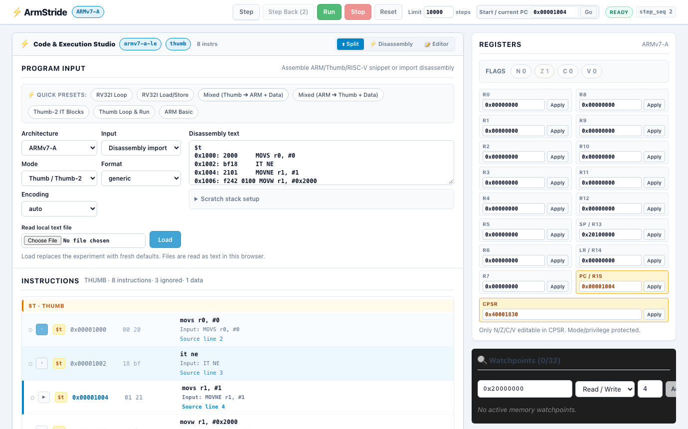
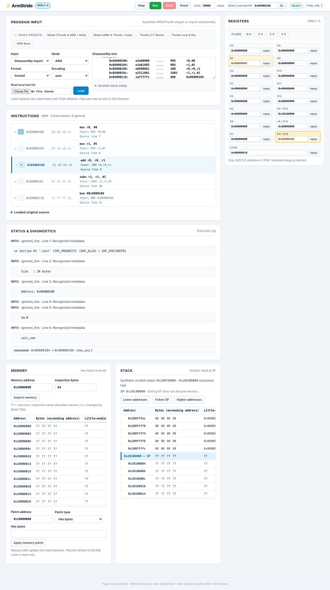
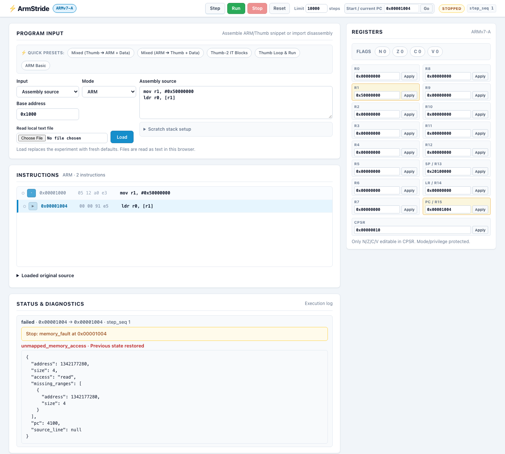

<div align="center">

# ⚡ ArmStride

**Paste assembly. Inject state. Step through it.**

*A lightweight, local, interactive ARMv7-A assembly & crash disassembly simulator.*

[](https://www.python.org/downloads/)
[](https://fastapi.tiangolo.com)
[](https://svelte.dev)
[](https://www.unicorn-engine.org/)
[](LICENSE)
[](docs/SRS.md)

<br/>



</div>

---

## 💡 Why ArmStride?

Embedded debugging often starts with incomplete evidence:
- A short snippet from a crash log (`PC`, fault address, registers).
- A fragment from an ARM `fromelf` or GNU `objdump` listing.
- A handful of known memory values and a corrupt stack.

Setting up a complete QEMU machine, full firmware image, target hardware, or GDB stub just to step through 5 instructions is slow and painful. **ArmStride lets you paste raw assembly or disassembly, inject known state, and step through instructions with deterministic memory and register tracking.**

📖 **[Read the Full Visual Tour & Workflow Guide](docs/VISUAL_GUIDE.md)**

---

## ✨ Key Features

| Feature | Description |
| :--- | :--- |
| ⚡ **Zero Setup & Local-First** | No target board, complete ELF file, or cross-compiler required. Runs 100% locally. |
| 🔀 **Mixed ARM/Thumb & Data** | Parses `$a`, `$t`, `$d` mapping symbols. Loads literal pools as non-executable known memory. |
| 🔄 **Runtime Interworking** | Full interworking via CPSR T-bit inspection (`BX`, `BLX`, `POP {pc}`, etc.) with canonical PC. |
| 🎯 **Thumb-2 IT Blocks** | Conditional block execution (`IT`, `ITT`, `ITE`) with `ITSTATE` tracking and skip reporting. |
| 🛑 **Breakpoints & Bounded Run** | Pre-execution breakpoints with 1-step resume bypass; bounded Run loop with concurrent Stop. |
| 📊 **Compact Register Grid** | 2-column tabular layout (R0–R15 + CPSR) with visual change indicators and inline editing. |
| 🧠 **Strict Memory Virtualization** | Distinguishes code, synthetic stack, and unmapped `??` bytes. Unmapped access halts safely. |
| ⏪ **Deterministic Stepping & Rollback** | Step instruction-by-instruction. Memory faults trigger atomic rollback to previous valid state. |
| ⌨️ **Keyboard Navigation** | `F5` to Run, `F7` / `F8` to Step, `F9` to Reset. |

---

## 📸 Visual Walkthrough

### 1. Interactive Step & Live Register Tracking
Step through instructions one by one. The active instruction pointer updates in real time, and modified registers (such as `R2`, `SP`, `PC`) are highlighted immediately with orange borders.


### 2. Disassembly Import (`objdump` & `fromelf`)
Paste crash log disassembly or compiler dumps. ArmStride automatically extracts addresses, raw hex opcodes, and mnemonics, mapping them to the execution view.



### 3. Safe Memory Faults & Atomic Rollback
Accessing unmapped memory (`??`) immediately pauses simulation and reports the exact missing byte ranges. The system safely rolls back to the pre-fault state without crashing.



---

## 🚀 Quickstart

### Prerequisites
- Python 3.12+ and [`uv`](https://docs.astral.sh/uv/)
- Node.js 22.12+ (for building frontend assets)

### 1. Installation & Build
```sh
# Clone repository
git clone https://github.com/RndelQndel/AsmStride.git
cd AsmStride

# Install Python dependencies and build frontend assets
uv sync --locked
npm ci --prefix frontend
npm --prefix frontend run build
```

### 2. Launch Workspace
```sh
uv run --locked armstride --port 8000
```
Open **[http://127.0.0.1:8000](http://127.0.0.1:8000)** in your browser.

---

## 🐍 Headless Python SDK Usage

ArmStride can also be scripted directly in Python without launching the browser UI:

```python
from armstride.parser import parse
from armstride.simulation import SimulationSession

# Parse disassembly snippet
result = parse("0x1000: E3A0002A MOV r0,#42\n0x1004: E2801008 ADD r1,r0,#8", mode="arm")
assert result.program is not None

# Initialize simulation session
session = SimulationSession()
try:
    session.load(result.program)
    step1 = session.step()
    assert step1["status"] == "executed"
    assert session.snapshot().registers["r0"] == 42

    step2 = session.step()
    assert session.snapshot().registers["r1"] == 50

    # Reset back to initial baseline
    session.reset()
    assert session.snapshot().registers["r0"] == 0
finally:
    session.close()
```

---

## 🧪 Testing & Quality Assurance

ArmStride maintains 100% regression-free test coverage across unit, simulation, integration, frontend, and browser end-to-end layers (447 automated tests passing):

```sh
# Run Python unit tests (API, parsers, logical memory)
uv run --locked pytest

# Run integration tests with native Unicorn & Keystone backends
uv run --locked pytest tests

# Run Vitest frontend unit tests
npm --prefix frontend test

# Run Playwright end-to-end browser tests
npm --prefix frontend run test:e2e

# Verify package release build (wheel & sdist)
uv run --locked python tests/verify_release.py
```

---

## 🏗 Architecture

```text
Browser UI (Svelte 5) ──HTTP REST──> FastAPI Service ──> Simulation Engine
                                                            ├── ProgramImage (Assembler / Parsers)
                                                            ├── Virtual Memory & Synthetic Stack
                                                            └── Unicorn / Keystone Backends
```

Detailed architectural specifications and milestone documentation:
- [Visual Guide & Tour](docs/VISUAL_GUIDE.md)
- [System Requirements Specification (SRS)](docs/SRS.md)
- [Architecture & State Management](docs/ARCHITECTURE.md)
- [Product P1 Specification & Roadmap](docs/milestones/P1.md)
- [Example Snippets & Crash Logs](examples/README.md)

---

## 📄 License

MIT License. See [LICENSE](LICENSE) for details.
