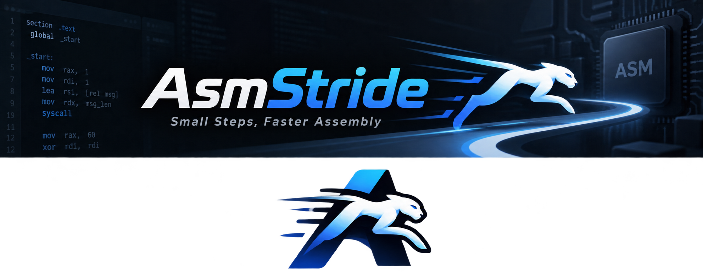

<div align="center">



# ⚡ ArmStride

**Paste assembly. Inject state. Step through it.**

*A lightweight, local, interactive ARMv7-A & RISC-V (RV32I) assembly & crash disassembly simulator.*

[](https://www.python.org/downloads/)
[](https://fastapi.tiangolo.com)
[](https://svelte.dev)
[](https://www.unicorn-engine.org/)
[](LICENSE)
[](docs/milestones/P3.md)

</div>

---

## 💡 Why ArmStride?

Embedded debugging often starts with incomplete evidence:
- A short snippet from a crash log (`PC`, fault address, registers).
- A fragment from an ARM `fromelf`, GNU `objdump`, or RISC-V disassembly listing.
- A handful of known memory values and a corrupt stack.

Setting up a complete QEMU machine, full firmware image, target hardware, or GDB stub just to step through 5 instructions is slow and painful. **ArmStride lets you paste raw assembly or disassembly (ARMv7-A, Thumb-2, or RV32I), inject known state, and step through instructions with deterministic memory and register tracking.**

📖 **[Read the Full Visual Tour & Workflow Guide](docs/VISUAL_GUIDE.md)**

---

## ✨ Key Features

| Feature | Description |
| :--- | :--- |
| ⚡ **Zero Setup & Local-First** | No target board, complete toolchain, or cross-compiler required. Runs 100% locally. |
| 🌐 **Multi-ISA Support** | First-class support for **ARMv7-A / Thumb-2** and **RISC-V RV32I (little-endian)**. |
| 🦀 **Pure-Python RV32I Assembler** | Built-in two-pass RV32I assembler with local labels, ABI aliases, and pseudoinstruction expansion. |
| 🛡️ **Strict x0 Immutability** | Guaranteed `x0 = 0` invariant; instruction writes produce no deltas; manual edits reject with 422. |
| 🛑 **Environment Traps** | Clean handling of `ECALL` and `EBREAK` into explicit debugger stop reasons without native engine crashes. |
| 📦 **ELF32 Loading & Symbols** | Ingest raw ARM/Thumb ELF32 executables; parse ELF sections, symbol tables, and DWARF source lines. |
| 👀 **Memory Watchpoints** | Set byte-range read/write watchpoints; observe granular access hits and halt bounded runs. |
| ⏪ **Bounded Step Back** | Reverse stepping with complete micro-step transaction rollback while preserving step sequence invariance. |
| 🔀 **Mixed ARM/Thumb & Data** | Parses `$a`, `$t`, `$d` mapping symbols. Loads literal pools as non-executable known memory. |
| 🔄 **Runtime Interworking** | Full interworking via CPSR T-bit inspection (`BX`, `BLX`, `POP {pc}`, etc.) with canonical PC. |
| 🎯 **Thumb-2 IT Blocks** | Conditional block execution (`IT`, `ITT`, `ITE`) with `ITSTATE` tracking and skip reporting. |
| 🛑 **Breakpoints & Bounded Run** | Pre-execution breakpoints with 1-step resume bypass; bounded Run loop with concurrent Stop. |
| 📊 **Light Workbench UI** | Central Source/Disassembly tabs, input sidebar, compact architecture-aware debugger rows, bottom tool tabs, and persistent machine status. |
| 🧠 **Strict Memory Virtualization** | Distinguishes code, synthetic stack, and unmapped `??` bytes. Unmapped access halts safely. |
| ⌨️ **Keyboard Navigation** | `F5` to Run, `F7` / `F8` to Step, `F9` to Reset. |

---

## 📸 Visual Walkthrough

The **ArmStride workbench UI** uses a Light theme by default. Input configuration lives in the left sidebar; Source, Disassembly, and Split views occupy the center; Run and Debug state lives on the right. Problems, Output, Memory, Stack, and Execution share a bounded bottom panel. The status bar keeps profile, live mode, PC, session state, step sequence, and history visible.

Use the Activity Bar to switch Input, Debug configuration (run limits), and Memory tools. The Debug and Panel toolbar buttons toggle their panes. Editor and bottom tabs support arrow keys and Home/End. Each pane scrolls independently; desktop debugging does not require scrolling the browser page. Register edits retain Enter/Apply semantics.

### 1. Light Workbench & Live Register Tracking
Choose architecture and input settings in the left **IN** sidebar, edit text in the central **Source** tab, then click **Load** to open **Disassembly**. Use **Split** to see both. Step through instructions one by one. The active instruction pointer updates in real time, and modified registers (such as `R2`, `SP`, `PC`) are highlighted immediately with a subtle amber background.


### 2. Disassembly Import (`objdump` & `fromelf`)
Select **Disassembly import** in the left sidebar, then paste crash log disassembly or compiler dumps into **Source**. ArmStride automatically extracts addresses, raw hex opcodes, and mnemonics, mapping them to the execution view.


### 3. Safe Memory Faults & Atomic Rollback
Accessing unmapped memory (`??`) immediately pauses simulation and reports the exact missing byte ranges. The system safely rolls back to the pre-fault state without crashing. Read the details in the bottom **Execution** tab, patch known bytes in **Memory**, and retry without navigating away from the editor.


### 4. RISC-V (RV32I) Multi-ISA Workspace
Switch architecture to **RISC-V (RV32I)** to debug 32-bit integer RISC-V snippets. The UI automatically renders the compact 32-register table (`x0`–`x31`) with standard ABI names (`zero`, `ra`, `sp`, `a0`–`a7`, `t0`–`t6`, `s0`–`s11`), locks immutable `x0 (zero)` to 0, and hides ARM-specific processor-state controls (CPSR and NZCV flags).


---

## 🚀 Quickstart

### Prerequisites
- Python 3.12+ and [`uv`](https://docs.astral.sh/uv/)
- Node.js 22.12+ (for building frontend assets)

### 1. Installation & Build
```sh
# Clone repository
git clone https://github.com/RndelQndel/AsmStride.git
cd AsmStride

# Install Python dependencies and build frontend assets
uv sync --locked
npm ci --prefix frontend
npm --prefix frontend run build
```

### 2. Launch Workspace
```sh
uv run --locked armstride --port 8000
```
Open **[http://127.0.0.1:8000](http://127.0.0.1:8000)** in your browser.

### 3. First debugging session

1. In the left **IN** sidebar, keep `ARMv7-A`, `Assembly source`, and `ARM` selected.
2. Edit the central **Source** tab or use the starter snippet, then click **Load**.
3. Press **F7/F8** to Step; inspect changed registers on the right and the live PC in the status bar.
4. Click a circle in the disassembly gutter to add a breakpoint, then press **F5** to Run. **DB** in the Activity Bar opens Run limits.
5. Switch between **Execution**, **Memory**, and **Stack** in the bottom panel while keeping code visible.
6. Use **Step Back** to undo an execution step or **Reset** to restore the baseline. Register edits use Enter/Apply and update that baseline.

For ELF import, watchpoints, memory repair, RV32I, and session recovery, follow the [Workbench Walkthrough](docs/VISUAL_GUIDE.md).

---

## 🐍 Headless Python SDK Usage

ArmStride can also be scripted directly in Python without launching the browser UI:

```python
from armstride.backends.keystone import KeystoneAssembler
from armstride.parser import parse
from armstride.simulation import SimulationSession

# --- Example 1: ARMv7-A Disassembly Snippet ---
result = parse("0x1000: E3A0002A MOV r0,#42\n0x1004: E2801008 ADD r1,r0,#8", mode="arm")
session = SimulationSession()
try:
    session.load(result.program)
    step1 = session.step()
    assert step1["status"] == "executed"
    assert session.snapshot().registers["r0"] == 42

    session.step()
    assert session.snapshot().registers["r1"] == 50
finally:
    session.close()

# --- Example 2: RISC-V RV32I Assembly Snippet ---
asm = KeystoneAssembler()
rv32 = asm.assemble("""
li a0, 0
li a1, 5
loop:
    addi a0, a0, 1
    blt a0, a1, loop
ebreak
""", mode="riscv32", profile="rv32i-le", base_address=0x1000)

session = SimulationSession()
try:
    session.load(rv32.program, initial_pc=0x1000)
    res = session.run()
    assert res["stop_reason"] == "breakpoint_trap"
    assert session.runtime.registers["x10"] == 5
finally:
    session.close()
```

---

## 🧪 Testing & Quality Assurance

Regression suites cover parsers, simulation, APIs, native integration, frontend components, and browser workflows. Workbench validation passed 470 Python tests, 32 frontend unit tests, 16 Playwright E2E tests, and four documentation captures; these counts describe the validated refactor, not a coverage percentage.

```sh
# Run Python unit & simulation tests (API, parsers, RV32I engine, logical memory)
uv run --locked pytest

# Run integration tests with native Unicorn & Keystone backends
uv run --locked pytest tests

# Check and build frontend assets before browser tests
npm --prefix frontend run check
npm --prefix frontend run build

# Run Vitest frontend unit tests
npm --prefix frontend test

# Run Playwright end-to-end browser tests
npm --prefix frontend run test:e2e

# Verify package release build (wheel & sdist)
uv run --locked python tests/verify_release.py
```

---

## 🏗 Architecture

```text
Browser UI (Svelte 5) ──HTTP REST──> FastAPI Service ──> Simulation Engine
                                                            ├── ProgramImage (ARM & RV32I Assemblers / Parsers)
                                                            ├── Virtual Memory & Synthetic Scratch Stack
                                                            └── Unicorn / Keystone Backends (ARMv7-A & RV32I)
```

Detailed architectural specifications and milestone documentation:
- [Visual Guide & Tour](docs/VISUAL_GUIDE.md)
- [System Requirements Specification (SRS)](docs/SRS.md)
- [Architecture & State Management](docs/ARCHITECTURE.md)
- [Product P1 Specification & Roadmap](docs/milestones/P1.md)
- [Product P2 Specification & Roadmap](docs/milestones/P2.md)
- [Product P3 Specification & Roadmap (RISC-V RV32I)](docs/milestones/P3.md)
- [Example Snippets & Crash Logs](examples/README.md)

---

## 📄 License

MIT License. See [LICENSE](LICENSE) for details.
