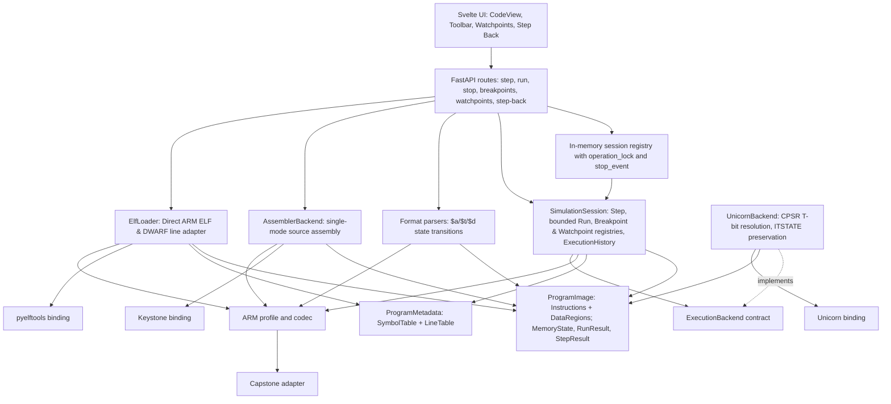

# ArmStride Architecture

Status: Architecture specification for [SRS.md](SRS.md). Product P0 and Product P1 baselines are fully verified and accepted as the stable foundation across 410 integration tests and Playwright suites. Product P2 defines the completed/defined ARM debugger and input expansion baseline (see [milestones/P2.md](milestones/P2.md)). Product P3 defines the planned multi-ISA expansion to RISC-V (RV32I) with feasibility verified via spike (see [milestones/P3.md](milestones/P3.md)).

## 1. Architectural principles and requirement basis

The SRS is the behavioral contract. Its baseline assumptions A-01–A-08, Product P1 assumptions P1-A-01–P1-A-08, Product P2 assumptions P2-A-01–P2-A-10, engine-based execution scope, memory policy, user-baseline lifecycle, and operational bounds are binding here. [concept.md](concept.md) supplies product intent; [README.md](../README.md) supplies the public summary. Historical Phases 0–8 (P0) and Stages P1-A–P1-F (P1) describe how the baselines were built and verified, and now serve as immutable historical evidence. Product P2 is organized into dependency-ordered implementation stages (P2-A through P2-F) with a parallel, non-blocking Cortex-M feasibility research track (P2-R).

Apply YAGNI to a small local developer tool: one process, normal HTTP, in-memory sessions, and one execution engine. There is no database, authentication service, distributed worker, plugin registry, symbolic execution, or angr dependency. There is no backward-compatibility requirement. Separate pure parsing/normalization from execution, and execution policy from HTTP and rendering. Use small modules and composition; introduce interfaces only at demonstrated boundaries. ARM details belong in one profile/codec and the Unicorn adapter, not in endpoint handlers or Svelte components.

The core owns product semantics. Unicorn supplies CPU execution, not session policy, user defaults, baseline selection, input parsing, or the definition of known memory. The frontend renders domain results and does not infer CPU behavior from pasted mnemonic strings.

### Requirement-to-component map

#### Product P0 baseline map

| SRS obligations | Responsible components | Primary verification |
| --- | --- | --- |
| FR-001–004, FR-017 | Dual input form, assembler boundary, format parsers, ARM decoder/profile, ProgramImage validation | Parser and encoding fixtures; atomic load tests |
| FR-005–009, FR-019, FR-022 | SimulationSession, ARM profile, UnicornBackend | PC, flags, branch, width, and register execution tests |
| FR-010–012, FR-018 | MemoryState, backend access hooks, MemoryView/StackView | Strict byte-range, patch, stack, and rollback tests |
| FR-013–014 | StepResult, frontend state owner and code/register/memory components | Delta tests and component tests |
| FR-015, FR-023 | Session baseline and snapshot operations | Manual-edit preservation and Reset isolation tests |
| FR-016 | Domain errors and transactional Step boundary | Fault injection and multi-access rollback tests |
| FR-020 | In-memory session registry and per-session lock | Isolation, concurrent requests, deletion/expiry tests |
| FR-021, FR-024 | FastAPI boundary, local launcher, Svelte controls, session Step counter | API/browser workflows and monotonic `step_seq` tests |

#### Completed Product P1 baseline map

| P1 obligations | Responsible components | Primary verification |
| --- | --- | --- |
| P1-FR-001, P1-FR-002, P1-FR-018 | Parser state machine (`$a`/`$t`/`$d`), `DataRegion`, `ProgramImage` extensions | Parser fixtures P1-PF-01–04, literal read tests, non-executable data tests |
| P1-FR-003, P1-FR-004, P1-FR-005 | `ExecutionLocation`, `SimulationSession`, `UnicornBackend` CPSR T-bit resolution | ARM/Thumb interworking tests, BX/BLX/POP-PC golden cases, rollback tests |
| P1-FR-006, P1-FR-007, P1-FR-008 | `DecodeMetadata` IT context, `UnicornBackend` ITSTATE handling, `StepResult` | Headless P1 IT spike, sequential IT/ITT/ITE execution/skip golden tests |
| P1-FR-009, P1-FR-010, P1-FR-012 | `SimulationSession.run()`, execution limits, `RunResult` | Sequential Run tests, step/time limit cutoff tests, monotonic `step_seq` tests |
| P1-FR-011 | `SessionEntry.stop_event`, concurrent `POST .../stop` endpoint | Concurrent stop integration tests, mid-step atomic completion tests |
| P1-FR-013, P1-FR-014, P1-FR-015, P1-FR-016 | `BreakpointRegistry`, `SimulationSession`, breakpoint API routes | Pre-execution stop tests, one-time resume bypass tests, lifecycle tests |
| P1-FR-017 | Svelte `CodeView`, `Toolbar`, `StatusPanel`, typed API client | Frontend component and Playwright workflow tests for mixed listings, Run/Stop, breakpoints |

#### Product P2 requirement map

| P2 obligations | Responsible components | Primary verification |
| --- | --- | --- |
| P2-FR-001, P2-FR-002, P2-FR-006 | `ElfLoader`, `ElfHeaderValidator`, `ProgramImage` validation | ELF fixture contracts, architecture/class/endianness rejection tests, resource bounds tests |
| P2-FR-003, P2-FR-004 | `ElfSegmentMapper`, `MemoryState`, `DataRegion` | PT_LOAD executable/data mapping tests, BSS explicit zero-init tests, memory bounds tests |
| P2-FR-005 | `SimulationSession.load`, `e_entry` initialization | Entry-point start PC tests, Thumb entry canonicalization and mode initialization tests |
| P2-FR-007, P2-FR-008 | `SymbolTable`, `ProgramMetadata`, decoupled symbol indexer | Symbol resolution tests, stripped ELF equivalence tests, duplicate/local disambiguation tests |
| P2-FR-009, P2-FR-010 | `LineTable`, `ProgramMetadata`, DWARF `.debug_line` adapter | DWARF line mapping tests, missing-source metadata display tests, malformed DWARF tolerance tests |
| P2-FR-011, P2-FR-015 | `WatchpointRegistry`, `SimulationSession` | Watchpoint CRUD tests, address range validation tests, lifecycle survival tests |
| P2-FR-012, P2-FR-014 | `SimulationSession.step/run`, committed memory event inspector | Post-instruction committed boundary stop tests, same-value write trigger tests, multi-access LDM/STM tests |
| P2-FR-013 | `SimulationSession.step`, transactional rollback coordinator | Faulted Step isolation tests (unmapped/failed accesses do not fire watchpoints) |
| P2-FR-016, P2-FR-017, P2-FR-021 | `ExecutionHistoryJournal`, `SimulationSession.step_back` | Exact register/CPSR/PC/memory restoration tests, User Baseline isolation tests, capacity FIFO tests |
| P2-FR-018, P2-FR-019, P2-FR-020 | `SimulationSession`, monotonic `step_seq`, history invalidator | Monotonic counter invariance tests, branching forward-purge tests, manual edit invalidation tests |
| P2-FR-022 | Svelte `CodeView`, `Toolbar`, `WatchpointPanel`, `StatusPanel` | Frontend component and Playwright workflow tests for ELF upload, symbols, watchpoints, and Step Back |

#### Product P3 planned requirement map (RISC-V Introduction — RV32I)

| P3 obligations | Responsible components | Primary verification |
| --- | --- | --- |
| P3-FR-001, P3-FR-007 | `RiscvUnicornBackend`, `BaseUnicornBackend`, `SimulationSession` | Headless P3 spike, RV32I execution tests, 32-bit wrapping arithmetic, rollback tests |
| P3-FR-002, P3-FR-003 | `ArchitectureProfile`, `MachineState`, `SimulationSession` | Strict `x0` immutability tests, rejection of edits to `x0`/`zero`, ABI alias mapping tests |
| P3-FR-004, P3-FR-005 | `domain.models`, `ProgramImage`, `Instruction` | Multi-ISA profile decoupling, dynamic execution mode separation, profile validation tests |
| P3-FR-006 | `RiscvControlFlowInterpreter`, `BranchAnalysis` | RV32I branch condition evaluation tests (`BEQ`, `BLT`, etc.), JAL/JALR target tests |
| P3-FR-008, P3-FR-010 | `RiscvAssembler`, golden test suite | Assembly source tests, label resolution, independent `llvm-mc`/GNU oracle equivalence |
| P3-FR-009 | `RiscvDisassemblyParser`, `Capstone` RV32 decoder | Addressed disassembly import tests, authoritative machine bytes tests |
| P3-FR-011, P3-FR-012 | `MemoryState`, `SimulationSession.load` | Partial memory tests, synthetic scratch stack at `0x200F0000`, `sp`/`x2` initialization |
| P3-FR-013 | `SimulationSession` debugger mechanisms | Run, Stop, Breakpoints, Watchpoints, Step Back, and Reset reuse tests on RV32I sessions |
| P3-FR-014 | `RiscvControlFlowInterpreter`, `SimulationSession` | `ECALL` and `EBREAK` stop trap tests, actionable stop reason reporting |
| P3-FR-015 | Svelte `RegisterPanel`, `ProgramInput`, `CodeView`, API views | Dynamic register rendering, suppression of CPSR/flags on RISC-V, UI workflow tests |
| P3-FR-016 | Test runner and regression fixtures | Full ARMv7-A / Thumb-2 automated regression green verification |

## 2. Recommended technology stack

Unicorn 2.1.4, Capstone 5.0.7 and Keystone 0.9.2 are installed and verified on the recorded host; FastAPI 0.141.1, Pydantic 2.13.5 and Uvicorn 0.54.0 implement the API; Phase 7 implements Svelte/TypeScript/Vite; exact frontend versions are pinned in its manifest and lockfile. In Product P2, `pyelftools` is introduced for reading ELF headers, PT_LOAD segments, symbol tables, and DWARF `.debug_line` sections. Pin compatible releases and lock dependencies during implementation after the backend correctness gate in Section 15. No arbitrary “latest version” requirement is needed.

| Choice | Why it fits / trade-off |
| --- | --- |
| Python 3.12+ | Suitable for text normalization, small immutable domain records, tests, and a thin execution-library adapter. Native CPU execution stays in Unicorn. Python is an implementation choice, not an input format or product identity. |
| Unicorn Engine, Python binding | Sole P0/P1/P2 CPU executor. It exposes register/memory access, execution control, and hooks needed for the Step boundary. It does not reconstruct firmware or determine what memory is known. Its precise ARM/Thumb behavior must pass the conformance gate; it is not a substitute for the SRS. See the [official tutorial](https://www.unicorn-engine.org/docs/tutorial.html) and [FAQ](https://github.com/unicorn-engine/unicorn/blob/master/docs/FAQ.md). |
| Capstone, Python binding | A small additional runtime dependency for decoding bytes, validating instruction width, identifying operands/conditions/control-flow families, and showing decoded text. This supports FR-004, FR-017, and FR-022; it is not a second execution engine or binary-analysis framework. Parsing pasted mnemonic strings cannot reliably identify aliases, PC writes, or misleading text. See [Python API and instruction detail](https://www.capstone-engine.org/lang_python.html). |
| Keystone Engine 0.9.2, Python binding | ARM/Thumb snippet assembler behind the application-owned AssemblerBackend contract. Receives the origin, emits bytes; no objects/linker or firmware toolchain in the product workflow. Native packaging and mapping limitations are recorded in Section 3. |
| pyelftools (P2) | Pure-Python library for reading ELF structures and DWARF debug information. Used strictly within the ELF loader pipeline (`src/armstride/elf/`) to extract headers, loadable PT_LOAD segments, symbol tables, and `.debug_line` tables into domain records. It is never imported by the simulation core, session registry, API schemas, or frontend, and its native objects never leak across domain boundaries. Pin compatible release (e.g. 0.31+) when implementing Stage P2-A. |
| FastAPI with Pydantic and Uvicorn | A compact request/response boundary with typed validation and generated OpenAPI for the frontend contract. Domain records remain independent of Pydantic. A minimal custom HTTP server would require more manual validation/error plumbing; Django is unnecessary. [FastAPI features](https://fastapi.tiangolo.com/features/) support this choice. |
| pytest | Parser tables, core behavior, real-engine integration, and API tests share a simple Python test runner. No test service or external database is needed. |
| uv | Manage the Python environment, dependency resolution/lock, and local developer commands in one tool. It does not become a runtime service. See [uv documentation](https://docs.astral.sh/uv/). |
| Svelte + TypeScript | A few reactive panels must agree on current PC, changed values, pending requests, and validation errors. Svelte components provide an explicit ownership boundary with less manual DOM synchronization than vanilla TypeScript. React is viable but brings no specific advantage for this single-page tool. No SvelteKit, SSR, router, or global state framework is needed. See [Svelte documentation](https://svelte.dev/docs). |
| Vite | Frontend development and static production build; production assets are served by the local Python application. It is not a second production server. See [Vite guide](https://vite.dev/guide/). |
| Custom lightweight code viewer | Selectable monospaced lines with a gutter, current-PC marker, decoded/source text, and scrolling satisfy P0. Use a plain textarea for paste/edit input. No code-editor dependency in P0. |

### Code-view alternatives

Monaco supplies a full browser editor, but P0 does not require language services, completion, multi-file editing, refactoring, minimaps, or editor extensions. Integrating editor models, workers, and decorations is not justified merely to show hundreds of instruction lines; [Monaco's project description and integration guidance](https://github.com/microsoft/monaco-editor) describe that broader editor role. Reconsider it only for demonstrated editing requirements.

CodeMirror is a reasonable smaller editor candidate if structured inline assembly editing, search, or richer selection later becomes a requirement. It is still unnecessary for the current read-only normalized code pane. The custom viewer must preserve text selection, keyboard operation, gutter markers, and scrolling, but must not grow into a home-made syntax editor. Render address/bytes/mnemonic as separate spans; a syntax grammar and viewport virtualization are unnecessary for the intended workload.

### Local deployment

The `armstride` command starts one Uvicorn worker on loopback, serves `/api` and packaged `src/armstride/static/` assets when an `index.html` exists, and prints the local URL. Before the frontend build is available, `/` serves an API landing page. `/api/openapi.json` exposes the transport contract; missing API routes never fall through to static HTML. Automatic browser opening is optional launcher convenience, not a core dependency. Use a Vite proxy to `/api` during development, preserving same-origin browser requests. Production requires no Node server or external service. Bind only to loopback, validate Host, and accept browser mutations only from the served origin; no permissive CORS. These are local-boundary controls, not a new authentication subsystem.

## 3. System architecture and dependency direction



Arrows show source dependencies or calls; the backend implements a core-owned contract. The composition root selects the ARM assembler, parser, and ELF loader producers, session registry, and execution backend factory. All three producers return an optional validated ProgramImage (ELF additionally returns ProgramMetadata); only a successful candidate is passed to SimulationSession.load. FastAPI routes validate transport input, look up and lock a session, call one core operation, and serialize results. They do not implement register aliases, branch evaluation, instruction sizes, memory defaults, or Reset behavior.

The simulation core imports neither FastAPI/Pydantic nor frontend code. Parsers, assemblers, and ELF loader create records, never emulator instances; the core does not import Keystone or pyelftools. In P1, `SessionEntry` introduces a thread-safe `stop_event` primitive that allows `POST .../stop` to signal cancellation directly without waiting on the active Run mutation lock. In P2, `SimulationSession` incorporates a `WatchpointRegistry` (committed-boundary memory access monitoring) and an `ExecutionHistoryJournal` (bounded, linear Step Back journal). HTTP is the only UI/core transport; there is no WebSocket or streaming.

## 4. Domain model and ownership

Favor immutable value records for parse output, instructions, data regions, snapshots, results, breakpoints, and errors. Mutable state has one owner: its SimulationSession. Avoid class hierarchies for input formats and ISA families that do not yet exist.

| Object | Responsibility and important fields | Ownership, lifetime, relationships |
| --- | --- | --- |
| Instruction | One addressed decoded instruction: `address`, `raw_bytes`, derived `size`, `source_line`, `source_text`, `display_text`, `decoded_text`, `architecture`, `mode` (`arm` or `thumb`), normalized decode metadata, `feature_exclusion` and reason if known. | Immutable member of ProgramImage; retained until reload/session destruction. Contains no library objects/constants. |
| DataRegion | One addressed concrete data record (e.g. literal pool): `address`, `raw_bytes`, derived `size`, `source_line`, `source_text`, `display_text`. Non-executable; mapped into known memory. | Immutable member of ProgramImage; retained until reload/session destruction. |
| ProgramImage | Validated executable listing: `instructions` (ARM and Thumb), `data_regions`, `execution_locations` index mapping `(address, mode)` to Instruction, address index, original text, parser format. | Immutable per successful load; shared by current state and baseline. Gaps are neither instructions nor initialized bytes. |
| ProgramMetadata (P2) | Optional auxiliary debug metadata: `symbols: SymbolTable`, `lines: LineTable`, and ELF section bounds. Completely decoupled from execution; absence never impairs simulation. | Owned by SimulationSession alongside ProgramImage; retained until reload/session destruction. Zero native library objects. |
| SymbolTable (P2) | Resolved symbol index: `by_address: dict[int, list[SymbolEntry]]`, `by_name: dict[str, SymbolEntry]`. Each entry has `name`, `address`, `size`, `binding` (`LOCAL`/`GLOBAL`/`WEAK`), and `kind` (`FUNC`/`OBJECT`/`NOTYPE`). | Value object inside ProgramMetadata; read-only metadata for UI navigation, PC labels, and breakpoint targeting. |
| LineTable (P2) | DWARF `.debug_line` index mapping instruction addresses to `(file_path, line_number, column)`. Does not require or fetch host source text. | Value object inside ProgramMetadata; read-only metadata for source location display. |
| Breakpoint | Active execution breakpoint: `address`, `mode`. Identifies a valid loaded instruction start. | Value record owned by `BreakpointRegistry` on SimulationSession; preserved across Step, edits, and Reset; cleared on replacement Load. |
| Watchpoint (P2) | Active memory watchpoint: `address`, `length`, `kind` (`read`, `write`, `read_write`). Watches data memory access in `[address, address + length)`. | Value record owned by `WatchpointRegistry` on SimulationSession; preserved across Step, Run, edits, and Reset; cleared on replacement Load. |
| WatchpointHit (P2) | Value record of a triggered watchpoint at a committed Step boundary: `watchpoint`, `access_type` (`read` or `write`), `address`, `length`, `triggering_pc`. | Contained in `StepResult.watchpoint_hits` and `RunResult.watchpoint_hit`. |
| RunResult | Aggregated result of bounded Run: `start_step_seq`, `end_step_seq`, `steps_committed`, `stop_reason` (including `watchpoint`), `final_state`, `last_step`. | Ephemeral return value of a Run operation; no cumulative execution history is stored. |
| ExecutionHistoryEntry (P2) | Snapshot of state prior to an atomic Step commit: `step_seq`, `registers: RegisterState`, `cpsr: int`, `mode: str`, `pc: int`, `modified_memory` (lazily captured pre-Step original bytes for written intervals; retaining the first pre-value once for multiple writes to the same byte within one instruction), `last_step: Optional[StepResult]`. | Owned by `ExecutionHistoryJournal`; discarded on FIFO capacity limit or linear branching. |
| HistoryJournal (P2) | Bounded linear history queue (default capacity 100) on SimulationSession. Allows Step Back to restore Runtime State without touching UserBaselineState. | Managed by SimulationSession; cleared on manual edits, Reset, or replacement Load. |
| AssemblyResult / AssemblerBackend | `assemble(source, profile, mode, base_address)` returns original source, base address, emitted bytes, optional ProgramImage and application Diagnostic values. Single-mode per snippet in P1. | Stateless producer boundary in `assembly.py`; Keystone objects/errors/constants stay in `backends/keystone.py`. No architecture registry. |
| ArchitectureProfile | Small ARM profile value plus ARM-specific functions: register descriptors/aliases, address width, endianness, alignment, initial CPSR, explicit feature exclusions, condition evaluation, PC normalization. | Application-lifetime read-only object for `armv7-a-le`. |
| RegisterState | R0–R15 and CPSR values plus origin labels; aliases resolve to the same slot. N/Z/C/V are derived from CPSR, not separately writable storage. | Value snapshot owned by MachineState; replaced on committed operations. |
| MemoryState | Exact logical code/data/stack intervals, bytes and source labels; answers full-range access checks, pure inspections, validated patches, and cloning for a baseline/rollback. In P1, includes DataRegions as known, readable, non-executable data. | Mutable only through its session; it is authoritative for known bytes. Backend page mappings are a derived representation. |
| MachineState | Current RegisterState and MemoryState plus active mode; immutable public snapshots expose register values and region metadata, not all memory bytes. | Owned by one session. No second independent register source of truth in the UI. Backend state is synchronized at transaction boundaries. |
| StepResult | One attempted step: instruction identity, before/after PC, deltas, memory events, condition/control-flow result, IT execution context, watchpoint hits (P2), completion/stop/error. | Retain only latest result per session in State; historical results held in bounded HistoryJournal (P2). See Section 11. |
| SimulationSession | Program load, manual edits, Step, bounded Run, Step Back (P2), Reset, breakpoint & watchpoint management, and consistent snapshots. Fields: optional image/metadata/backend, Runtime State, optional User Baseline State, `step_seq`, `max_step_seq`, `state_revision`, breakpoints, watchpoints, history journal, latest result, readiness status. | Created/destroyed by registry. Owns one backend. Does not own HTTP locks, TTL, or request parsing. |
| UserBaselineState | Program reference, load defaults, registers/CPSR, restart PC and logical memory updated by accepted manual edits only. | Private session-owned state with an independent copy of memory/registers. Every manual edit updates the exact requested fields in baseline and runtime atomically. Reset clones it; CPU execution and Step Back never mutate it. |
| ParseResult | Optional normalized candidate image (with instructions and data regions), diagnostics, selected/detected format, parsed/ignored counts. | Short-lived per load request. An image is installable only with no errors and at least one instruction. |
| DomainError / Diagnostic | Stable code, message, structured context, severity and source line when relevant. | Values returned or raised at domain boundaries; independent of HTTP status. |
| ExecutionBackend | Behavioral contract for initializing, synchronizing edits, checkpoint/restore, attempting one instruction, reading resulting state, and closing native resources. In P1, handles CPSR T-bit mode transitions and ITSTATE preservation. | One UnicornBackend per loaded session. A test fake is the only other necessary implementation. |

The **session registry** is an application-layer dictionary of opaque IDs to session entries containing an operation lock, a thread-safe `stop_event`, and last-access time. It handles lifecycle and concurrency only; it must not absorb simulation logic. `MemoryRegion` and `RegisterDescriptor` are simple records inside MemoryState/profile, not standalone services. Do not introduce repositories, event buses, command buses, generic CPU factories, or a separate class for every use case.

## 5. Instruction representation and parsing

### 5.1 Encoded instructions

`raw_bytes` is the canonical opcode representation in increasing memory-address order. `size` equals its length, validated against the decoder. It is not an integer with an implicit width. ARM P0 has size four; Thumb has size two or four. The general record can hold other positive sizes without implying any other ISA is implemented.

Keep architecture (`armv7-a-le`) and execution mode (`arm`/`thumb`) explicit. They match the ProgramImage in P0; including mode in the record prevents an implicit “always ARM” assumption at decoder and execution boundaries. Addresses are canonical instruction addresses, not Thumb-tagged branch-pointer values.

Word-form input is normalized according to the format grammar: reverse the bytes of each ARM word, or of each Thumb halfword independently, for little-endian memory. Separated byte tokens are copied unchanged. Reject compact eight-digit Thumb words. Neither backend nor UI reverses those bytes again. API `bytes` values are hex byte strings in memory order, without an endianness reinterpretation.

The Capstone adapter converts decoding details into domain records. Decode exactly one instruction from each record at its preserved address and verify all supplied bytes are consumed. Use metadata for display, conditions/control flow, and a small guard for explicitly excluded features such as IT or system-state operations. Do not create an instruction-by-operand allowlist or duplicate ARM alias/encoding semantics. For ordinary integer instructions, the configured Unicorn engine decides execution capability; a runtime rejection becomes a failed Step. The validation classes in SRS Section 11 identify required golden coverage, not permission to execute. Pasted mnemonic text never drives execution, and successful decoding alone does not establish architectural validity or engine support.

### 5.2 Disassembly/import parser pipeline

```text
text + mode + format/encoding selection
    -> fixture-defined crash-log envelope removal (original line map retained)
    -> line classification by a fixed format adapter
    -> addressed opcode records and line diagnostics
    -> byte normalization
    -> ARM decode and explicit feature-exclusion annotation
    -> range, alignment, duplicate and overlap validation
    -> ParseResult
    -> install candidate only if fully valid
```

Use `FromElfParser`, `ObjdumpParser`, and `GenericParser` as small modules/functions with the same input/output records; no inheritance or runtime registration is required. Share hexadecimal token parsing and interval validation, not a single regex that guesses every format. A selected adapter operates on the whole text. Auto tries the fixed candidates, applies the SRS equivalence/ambiguity rule, and returns why explicit selection is needed.

Fromelf recognizes an opcode directly after the address, followed by an optional, unambiguously delimited ASCII column before the mnemonic. The [Arm Compiler User Guide](https://documentation-service.arm.com/static/63e677168e13d11599a91eca) illustrates this opcode/ASCII/mnemonic order; fixtures should use extracted instruction records from that layout. Objdump recognizes the address colon, opcode groups, labels, and listed header forms. Generic handles the strict normalized records. Recognize fixture-backed fromelf symbol blocks and the fixed timestamp/record prefixes in SRS Section 7.4. Preserve original line numbers through prefix removal and report ignored metadata. Unknown headers/prose fail visibly rather than being dropped by a broad “looks non-instruction” rule. Never treat ARM `#` immediates as trailing comments. Do not follow symbol annotations or create missing literal-pool bytes from them.

The parser collects errors rather than stopping at the first line; diagnostics include line number and original content. Duplicate addresses report both conflicting source lines. Range overlap is checked on byte intervals, not just instruction starts. Parser warnings may include unsupported encodings; fatal diagnostics include absent opcodes, malformed addresses, ambiguous encoding, bad width/alignment, overlaps, and empty programs. Partial previews are never executable.

Use SRS PF-01–PF-08 as the initial fixture contract. During the fixture phase, materialize 5–10 cases under `tests/fixtures/parser/`, including raw fromelf/objdump captures with provenance plus clearly labeled synthetic noise/error cases. Each case records mode/format, original text, normalized address/bytes/size records, ignored lines, diagnostics with original line numbers, and load success/failure. The inline document examples are seeds, not evidence of testing actual tool output. Broaden accepted wrappers only when a concrete fixture justifies the change; no log-parser plugin system is needed.

### 5.3 Assembly source producer

```text
ARM/Thumb source + explicit mode/profile/base -> KeystoneAssembler -> emitted bytes
    -> ArmDecoder.decode_stream (Capstone widths, concrete addresses, full consumption)
    -> immutable Instruction records -> ProgramImage -> SimulationSession.load

Addressed fromelf/objdump/generic/crash-log text -> existing parsers
    -> the same ProgramImage -> the same SimulationSession.load
```

`AssemblerBackend` is a small application-owned Protocol, not an ISA plugin framework. `KeystoneAssembler.assemble` validates text/profile/origin, gates unsupported directives, assembles at the requested origin, then uses the existing codec and ProgramImage validations. No post-assembly relocation, mnemonic execution, source-specific session/state/backend, or parallel result model exists. A failed assembly/decode has no image; successful normalization still requires the existing transactional load's memory/backend validation.

Keystone's supported labels and branches are passed directly to it. P0 admits only instructions, labels, comments, `.syntax unified` and explicit-mode-matching declarations. Reject other directives, macros, includes, layout/data emission, assignments and implicit literal pools; this keeps the entire emitted stream executable and bounded. Ordinary PC-relative instructions remain supported. Feature exclusions retain the import contract: decode annotations and warnings, followed by existing Step rejection/rollback.

The result and ProgramImage retain the complete original source. Generated Instruction `source_line` is null, `source_text` is empty, and display text equals decoded text; native statement counts are diagnostic context, never guessed source lines. The public Step identity also permits a null source line. Imported records still require their original one-based line numbers. This deliberately revises the earlier all-instructions-have-a-source-line assumption without weakening parser fixtures. Exact debug/source-line stepping is deferred; no object/debug-information machinery is introduced.

Future RISC-V assembler/parser producers may join the higher-level ProgramImage workflow **after ARM P0 is complete**. This phase adds no RISC-V implementation/dependency, register design, generic ISA registry, or tests. ARM profile validation remains explicit.

### 5.4 Direct ARM ELF loader pipeline

```text
ELF binary -> ElfHeaderValidator (EM_ARM, 32-bit LE, ET_EXEC only; ET_DYN deferred)
           -> ElfSegmentMapper (PT_LOAD segments: memory intervals and permissions PF_R, PF_W, PF_X)
           -> Mapping symbol partitioner ($a, $t, $d markers; mixed ARM/Thumb/Data ProgramImage)
           -> BSS expansion (p_memsz > p_filesz -> explicit known zeros)
           -> Capstone stream decode ($a and $t ranges up to 10k instructions)
           -> ProgramImage (instructions + data regions including $d literal pools)
           -> ElfMetadataExtractor (SymbolTable from .symtab/.dynsym + LineTable from DWARF .debug_line)
           -> ProgramMetadata (symbols + lines)
           -> SimulationSession.load(image, metadata, initial_pc=e_entry)
```

1. **Third producer role (ADR-019):** ELF loading is an input producer that emits the existing `ProgramImage` domain structure plus auxiliary `ProgramMetadata`. It creates zero parallel execution machinery (`ElfSimulationSession`, `ElfExecutionBackend`, etc.). After loading, the simulation core operates identically whether code originated from source assembly, disassembly import, or direct ELF.
2. **Supported ELF subset:**
   - Architecture: ARM (`EM_ARM` / 0x28).
   - Format: 32-bit little-endian (`ELFCLASS32`, `ELFDATA2LSB`).
   - ELF Type: Strictly `ET_EXEC` (executable). Position-independent executables (`ET_DYN` / PIE) are deferred to post-P2 until load-bias and relocation semantics are explicitly designed (absence of `PT_INTERP` does not prove `ET_DYN` requires no runtime relocation). Relocatable objects (`ET_REL`), core files (`ET_CORE`), and shared libraries are rejected with `unsupported_elf_type`.
3. **Memory & segment mapping (ADR-025):**
   - `PT_LOAD` defines memory placement and permissions (`PF_R`, `PF_W`, `PF_X`). It does NOT dictate that every byte of an executable segment is an instruction.
   - Executable segments (`PF_X`) are partitioned using ARM ELF mapping symbols (`$a` for ARM, `$t` for Thumb, and `$d` for inline data/literal pools), reusing the mixed ARM/Thumb/Data `ProgramImage` model from P1.
   - Any `$d` ranges inside executable segments remain non-executable `DataRegion`s mapped into known memory. Direct execution into a `$d` range halts with `non_executable_target`.
   - Ambiguous mixed executable regions without reliable mapping symbols fail closed with actionable diagnostic `ambiguous_elf_execution_mode`.
   - Segments with `PT_LOAD` and `PF_R` / `PF_W` without `PF_X` become `DataRegion` sequences (known, non-executable data).
   - Overlap validation: reject overlapping segments or segments colliding with scratch stack.
   - BSS zero-initialization: When `p_memsz > p_filesz`, the delta `[p_vaddr + p_filesz, p_vaddr + p_memsz)` is explicitly initialized to known zero bytes as a `DataRegion`. Page-padding bytes outside `p_memsz` remain strictly unknown memory.
4. **Entry point & initial mode:**
   - If `e_entry` has bit 0 set (`e_entry & 1 == 1`), the initial mode is `thumb` and canonical starting PC is `e_entry & ~1`.
   - If bit 0 is clear, initial mode is `arm` and starting PC is `e_entry`.
   - Address `0x00000000` is NOT inherently invalid; validate it against the loaded executable image (valid if an executable instruction is mapped there).
   - The canonical starting PC must match a loaded instruction start; otherwise loading is rejected with `invalid_pc`.
5. **Independent resource bounds (ADR-025):**
   - Raw ELF input file size <= 10 MiB.
   - Decoded instruction count <= 10,000 instructions.
   - Total logical loaded memory (including BSS) <= 16 MiB.
   - Backing-page allocation <= 64 MiB (reusing MemoryState page budget).
   - ELF segment count <= 32 segments, section count <= 128 sections.
   - Exceeding any limit immediately rejects the file with an actionable diagnostic (`elf_resource_limit_exceeded`). Speculative lazy disassembly is avoided.
6. **Metadata extraction & decoupling (ADR-020):**
   - Symbols extracted from `.symtab` or `.dynsym`: functions (`STT_FUNC`), objects (`STT_OBJECT`), and mapping labels. Stored in `SymbolTable`. Stripped ELFs without symbols are fully supported for execution.
   - DWARF source lines extracted from `.debug_line` into `LineTable`. Absence or corruption of DWARF does not halt execution; line metadata simply falls back to null. Source files are not read from the host filesystem.

## 6. Simulation core and state transactions

### 6.1 Load, edit, and inspect

A load builds a candidate ProgramImage and initialized MemoryState, validates scratch-stack placement and limits, then creates a candidate backend. Only after successful initialization does it replace the old experiment and close the old backend. An assembly, decode, parse, mapping, or backend initialization error leaves the previous session untouched.

Register edits resolve aliases through the profile, validate bounds/SP alignment/PC boundary/CPSR mask, update the backend, then publish current state. Memory patches validate the entire interval and budget before changing mappings or bytes. Patch failures restore the checkpoint rather than leaving a partial injection. Each manual edit applies its explicit write set to both UserBaselineState and Runtime State as one operation, then clears latest-step highlights/results. Validate both candidate states and memory budgets before mutation; if native synchronization fails, restore runtime and leave baseline unchanged. Never replace baseline with a copy of the entire current runtime. Inspection uses MemoryState directly, never emulator reads that could turn unknown backing bytes into visible zeros.

Register edits write one register; PC edits also set the baseline restart PC; byte patches update exactly their interval. A CPSR flag toggle applies its bit mask independently to each state, preserving other flags even if runtime and baseline differ. An explicit full editable-CPSR submission supplies all four N/Z/C/V bits. Execution-derived register values or neighboring memory bytes must never leak into baseline through an unrelated edit.

The core exposes operations matching requirements: load, snapshot, set PC, set register/flags, patch memory, inspect memory, Step, Reset. These can be methods on SimulationSession plus small pure validation/diff functions; a parallel “service layer” wrapping each method is unnecessary.

### 6.2 Step transaction

1. Reject a missing program, unavailable backend, or PC not in the image index. Resolve decoded metadata and reject known unsupported instructions. In Thumb-2 IT blocks, reject manual PC entry into the interior of an IT block when valid ITSTATE is not established.
2. Save a native CPU context checkpoint and a Runtime State memory snapshot. UserBaselineState is not part of execution mutation and needs no per-Step rewrite. Session operation serialization prevents concurrent edits.
3. Invoke `execute_one` at canonical PC with the active mode. Collect ordered, validated data read/write events; check full byte intervals and alignment before allowing effects. Stop immediately on the first rejected access.
4. Read the resulting registers/CPSR:
   - In P0 single-mode execution, mode changes were rejected.
   - In Product P1, interworking is supported: read resulting CPSR T-bit (`cpsr & 0x20`): if set, `resulting_mode = "thumb"`; if clear, `resulting_mode = "arm"`.
   - Canonicalize visible PC (`pc & 0xFFFFFFFE`).
   - Classify conditional execution, IT block context (`it_context`), and branch outcome from decoded metadata, pre-state and actual post-state.
5. On error, restore native CPU context and all affected backing bytes/mappings, retain the pre-state (including pre-Step mode), clear stale highlights, and return a failed StepResult. No attempt events become committed deltas. If restoration itself fails, mark the backend unavailable and require Reset/reload; retain the authoritative pre-state for recovery.
6. On success, apply collected writes to runtime MemoryState, publish the resulting register snapshot and active mode, and increment session `step_seq` once in the same commit. Compare before/after to produce deltas. Leave UserBaselineState unchanged. Failed attempts do not increment the counter.
7. Resolve `(resulting_pc, resulting_mode)` against `ProgramImage.execution_locations`:
   - If an instruction exists and its mode matches `resulting_mode`, session status is ready for the next Step.
   - If `resulting_pc` is outside loaded instruction starts, stop with `pc_not_loaded`.
   - If `resulting_pc` matches an instruction start but mode mismatches, halt with an explicit mode mismatch diagnostic.
   - If `resulting_pc` lands in a `DataRegion`, halt immediately with non-executable target stop reason.

### 6.3 Reset

Create a fresh backend and Runtime State from UserBaselineState, then atomically swap them in. This restores defaults plus all manual evidence, including edits made after successful or failed Steps, while discarding execution effects. The baseline retains its independent memory/register storage and is not aliased to mutable runtime. Restore profile defaults for unexposed native state; excluded IT/exclusive/system features are not part of the baseline. Breakpoints are explicitly preserved across Reset. Clear latest result/error/highlights, preserve session `step_seq`, and retain the latest manually set restart PC. If recreation fails, keep the baseline available for retry; do not erase the program or pretend Reset succeeded.

### 6.4 Bounded Run and concurrent Stop execution mechanics

Product P1 implements Run strictly by composing existing atomic Steps:

```python
def run(self, stop_event: threading.Event, max_steps: int = 10_000, max_seconds: float = 2.0) -> RunResult:
    start_seq = self.step_seq
    steps_committed = 0
    start_time = monotonic()
    stop_reason = None

    # Handle one-time resume bypass if starting at a breakpoint
    bypassed_bp = self._current_breakpoint()

    while True:
        if stop_event.is_set():
            stop_reason = "user_stop"
            break
        curr_bp = self._current_breakpoint()
        if curr_bp and curr_bp != bypassed_bp:
            stop_reason = "breakpoint"
            break
        bypassed_bp = None

        if steps_committed >= max_steps:
            stop_reason = "step_limit"
            break
        if (monotonic() - start_time) >= max_seconds:
            stop_reason = "time_limit"
            break

        step_res = self.step()
        if step_res.status == "failed":
            stop_reason = step_res.stop_reason or "execution_failure"
            break
        steps_committed += 1
        if step_res.stop_reason is not None:
            stop_reason = step_res.stop_reason
            break

    return RunResult(start_step_seq=start_seq, end_step_seq=self.step_seq,
                     steps_committed=steps_committed, stop_reason=stop_reason,
                     final_state=self.snapshot(), last_step=self.last_step)
```

1. **Step composition guarantee:** Run introduces no alternate execution engine or fast-path loop that skips memory checks, page journaling, rollback, or `step_seq` increments.
2. **Termination reasons:** Stable categories: `breakpoint`, `user_stop`, `step_limit`, `time_limit`, `pc_not_loaded`, `execution_failure`, `backend_unavailable`.
3. **Atomic cancellation:** A `Stop` request signals `stop_event` without acquiring the session's execution lock. The currently executing atomic Step finishes or rolls back completely before Run terminates and exits cleanly.

### 6.5 Breakpoints and resume bypass

1. **Identity & Storage:** Stored as `(address, mode)` tuples on `SimulationSession.breakpoints`.
2. **Validation:** Setting a breakpoint validates that `(address, mode)` exists in `ProgramImage.execution_locations`. Setting on DATA records, gaps, or unaligned addresses is rejected.
3. **Pre-execution halt:** When Run encounters a breakpoint, it halts before executing that instruction.
4. **Single-step bypass:** Manual `step()` ignores breakpoints completely.
5. **One-time resume bypass:** When Run starts at an active breakpoint, it bypasses that breakpoint once for the first step, then immediately resumes normal checking. If a loop branches back to the breakpoint, Run halts again.
6. **Lifecycle:** Breakpoints persist across Steps, manual edits, and Reset. Breakpoints are cleared when a new program is loaded via replacement Load.

### 6.6 Memory Watchpoint mechanics

1. **Watchpoint domain model:** Stored as `Watchpoint(address, length, kind)` where `kind` is `read`, `write`, or `read_write`. Up to 32 concurrent watchpoints are permitted.
2. **Post-instruction committed-boundary evaluation & dual observability (ADR-021):**
   - Breakpoints stop *before* instruction execution.
   - Watchpoints are discovered through actual committed memory accesses performed by an executing instruction.
   - Dual observability on Step and Run:
     - When a single Step completes and commits, if committed reads or writes overlap active watchpoints, `StepResult.watchpoint_hits` reports them while the session remains paused.
     - When bounded Run executes, after each Step commits, if committed watchpoint hits exist, Run halts immediately with `stop_reason = "watchpoint"`.
     - Multi-access instructions (e.g. `LDM`, `STM`): ordered multiple hits within the single Step are preserved.
     - Never rollback: A successful instruction is never rolled back merely because it triggered a watchpoint. State remains at a clean architectural Step boundary.
3. **Failed step isolation:** If an instruction faults (e.g. unmapped memory or invalid instruction), the Step transaction rolls back completely. Attempted accesses in a failed step never trigger watchpoint hits.
4. **Same-value writes:** A write operation that does not alter the numeric value of memory (`before_bytes == after_bytes`) is still an architectural CPU write event and MUST trigger any overlapping write watchpoint.
5. **Separation of execution stop state from debugger observations:**
   - A Step may simultaneously produce an architectural stop condition such as `pc_not_loaded` and one or more Watchpoint hits.
   - Neither fact is discarded: `RunResult.stop_reason` is `"watchpoint"`, and `RunResult.last_step.stop_condition` retains `"pc_not_loaded"`.
   - Deterministic stop precedence matrix:
     1. Pre-execution Breakpoint (Run stops before instruction execution; no memory access occurs, so no watchpoint can hit).
     2. Execution Fault (unmapped access, illegal instruction -> atomic rollback; no watchpoint hits; Run stops with fault reason).
     3. Post-execution Watchpoint Hit (instruction commits; Run stops with `"watchpoint"`; architectural stop preserved in `last_step_result`).
     4. Post-execution Architectural Stop (`pc_not_loaded` halts Run if no watchpoint was hit).
     5. User Stop (`POST /api/sessions/{id}/stop` signals clean stop between Steps).
     6. Run bounds (`step_limit` or `time_limit`).
6. **Decoupled from MMIO (ADR-024):** Watchpoints monitor logical memory accesses passively; they do not perform callbacks, alter values, simulate peripherals, or advance device timers.
7. **Lifecycle:** Watchpoints persist across Steps, Runs, manual edits, and Reset. Cleared only on explicit deletion or replacement program Load.

### 6.7 Bounded Step Back and execution history journal

1. **Journal structure:** `ExecutionHistoryJournal` maintains a bounded linear deque of `ExecutionHistoryEntry` records (default capacity 100).
2. **Refined recorded state:** Prior to committing each successful atomic Step, a snapshot of the pre-step state is pushed to the journal:
   - Registers R0–R15, CPSR, PC, and execution mode at the step boundary.
   - Pre-step original memory bytes captured lazily from the step's committed write events / write hooks.
   - For multiple writes to the same byte within one instruction, retain the pre-Step original byte once (the first pre-value observed) for exact reverse restoration.
   - Previous `last_step` result and current `step_seq`.
3. **Rewind mechanics:**
   - `step_back()` pops the most recent history entry.
   - Restores the exact register state, CPSR, PC, and memory bytes into the active `SimulationSession` and native backend.
   - Sets session status to `ready` or `stopped` depending on whether the restored PC is loaded.
4. **Monotonic `step_seq` invariance and state revisions (ADR-022):**
   - `step_seq` counts committed architectural forward Steps only.
   - Step Back must NOT increment or decrement `step_seq`.
   - After stepping backward, a newly committed forward Step continues from the existing monotonic maximum (`max_step_seq + 1`), not the historical restored value.
   - A separate `state_revision` integer counter tracks all state mutations (Step, Step Back, edit, Reset, Load) monotonically for client synchronization and cache invalidation.
5. **UserBaselineState isolation:**
   - Step Back restores Runtime State ONLY.
   - UserBaselineState is immutable with respect to execution and Step Back; Reset always restores from the intact User Baseline.
6. **Linear history & invalidation rules:**
   - If the user executes forward (`step()` or `run()`) after stepping back, any forward history entries beyond the current rewind point are purged (linear history; no branching time-travel trees).
   - Any manual state modification (register edit, memory patch, PC change) invalidates and clears the entire history journal.
   - Session Reset and replacement program Load clear the entire history journal.

## 7. Unicorn boundary and ARM/Thumb semantics

### Minimum backend contract

The core needs operations to initialize from a validated image/state, execute one decoded instruction transactionally, and close. Phase 3 synchronizes manual edits by building a candidate backend and swapping it only after initialization succeeds; checkpoints, register reads, and verified restoration remain private adapter operations. This avoids a second in-place edit rollback mechanism at the cost of bounded native recreation per edit. Results use domain names and byte arrays. The adapter owns Unicorn creation, CPU selection, page alignment/permissions, register constants, hooks, context handles, error translation, and native resource lifetime. Do not expose a generic arbitrary-native-operation escape hatch.

Use a fixed ARMv7-A-capable CPU model (Cortex-A15 is the initial candidate) with the selected little-endian ARM/Thumb mode and user CPSR. Apply only the explicit product feature exclusions; do not restrict ordinary integer instructions to the representative validation list or implement an ARM operand checker. Confirm the model and binding APIs against the pinned release at the backend gate; no silent fallback to a different CPU or mode is permitted.

### Register, mode, and PC translation

- Map domain R0–R12/SP/LR/PC/CPSR to Unicorn IDs in one table inside the adapter. Resolve aliases in the ARM profile before this boundary.
- Initialize all general registers, CPSR, mode, and scratch memory explicitly. Never rely on undocumented engine defaults. Write status/mode and PC in an order verified by integration tests.
- For Thumb, use the engine's required execution-entry convention inside the adapter (`address | 1`). Domain addresses and API PC values remain canonical/even. Do not strip bit 0 from ordinary register values or LR.
- Use native instruction execution for pipeline-PC reads, literal-load alignment, flags, call return addresses, and computed branches. The adapter reads post-PC/CPSR; the core never simulates these by incrementing PC.
- CPSR edits permit only N/Z/C/V bits (`0xF0000000`). A full CPSR edit may change only those bits relative to runtime CPSR and applies all four flag values to baseline and runtime. A one-flag UI toggle supplies only that flag mask and value, applied independently to each state. T and mode bits remain controlled by the image/profile.
- **P1 Runtime Interworking:** In Product P1, mode switching is authoritative from native execution. When `execute_one` completes, the adapter reads CPSR T-bit (bit 5). If set, mode is Thumb; if clear, mode is ARM. Subsequent `execute_one` calls use the resulting mode for entry address convention (`address | 1` for Thumb, `address` for ARM).
- **P1 Thumb-2 IT Blocks:** In Product P1, CPSR ITSTATE (`CPSR[15:10, 26:25]`) is preserved across Step transactions. Stepping the `IT` instruction updates CPSR ITSTATE. Subsequent Steps of IT-controlled instructions pass this CPSR directly to Unicorn. Controlled instructions that fail their condition are conditionally skipped: the engine advances PC past the instruction and updates ITSTATE without committing register or memory writes, reporting `condition_passed: false` and `executed: false`.

### Enforcing exactly one instruction

These are proposed adapter mechanisms, not verified library guarantees. Implementation begins with the headless Phase 0 spike in Section 15. The [Unicorn FAQ](https://github.com/unicorn-engine/unicorn/blob/master/docs/FAQ.md) documents instruction-count/PC behavior with version distinctions, while the [public API header](https://github.com/unicorn-engine/unicorn/blob/master/include/unicorn/unicorn.h) defines memory hooks, errors, and context operations. Neither reference is treated here as a guarantee of all-or-nothing instruction rollback. Record actual behavior for the selected version before depending on it.

Use Unicorn's instruction-count limit of one, a defensive code hook, and a finite per-attempt native timeout (initially one second). The count limit is an engine mechanism; the SRS remains the acceptance contract. Verify behavior for two-/four-byte Thumb instructions, ARM conditions that fail, self-branches, and calls/returns. Timeout is a failed Step with rollback, not a successful no-op. A second code hook must stop before another instruction executes if the engine attempts one. In P1 IT blocks, a conditionally skipped instruction also counts as exactly one instruction retirement.

Native instruction fetch can fail after a completed branch into an unmapped address. The adapter must distinguish this from a fault within the current instruction: a completed single instruction within the selected profile, no rejected data access/invalid-instruction event, and observed post-state/target consistent with its decoded control flow can yield successful retirement plus `pc_not_loaded`. A fetch fault before the first instruction never counts as success. Prove this distinction with sequential-end, external branch, POP-PC, and mid-instruction-target tests on the pinned engine. Do not turn all `UC_ERR_FETCH_*` errors into success. If completion cannot be established reliably, the backend gate is blocked until the adapter is corrected; do not weaken the SRS or execute placeholder target code.

### Branch reporting

The ARM profile evaluates the decoded condition against pre-Step N/Z/C/V, or the relevant register for CBZ/CBNZ. `condition_passed` applies to conditional instructions. For control flow, `taken` indicates whether its PC-transfer effect executed, even if the resulting PC equals fall-through. A non-control-flow instruction has `branch: null`. PC loads, returns, calls, and ALU-to-PC are classified as control flow as appropriate. Compare the predicted classification with the engine's resulting state; unexpected discrepancies are backend failures, not corrected by manually changing PC.

## 8. Memory model

### Logical memory versus backing pages

MemoryState owns sorted, non-overlapping exact byte intervals. Each carries bytes, permissions, and origin (`code`, `scratch_stack`, or `user`). P0 has no readable-but-unknown region: bytes without an interval are unknown and logically unmapped. Therefore an initialized-byte bitmap is unnecessary; sparse intervals represent partial evidence directly. Patches split/merge intervals while retaining source labels. A zero-fill request creates known bytes explicitly.

The backend maps the page-aligned union needed to hold those intervals. Page padding and holes are implementation storage only; they are not known memory. Do not expose their zero-filled backing bytes. Page permissions may need the union of code/data permissions for intervals sharing a page, so native page protections alone are insufficient.

Enforce logical permissions with the loaded instruction index before execution and valid/invalid memory hooks for data accesses. Check the complete `[address, address + width)` interval, alignment and address overflow, including cross-page/cross-region accesses. A write crossing code rejects the whole instruction. Data accesses to physically mapped padding still fail. Hooks stop emulation on rejection; rollback is mandatory because a native engine may already have changed other state during a multi-access instruction.

| Region | Logical permission | Initialization |
| --- | --- | --- |
| Instruction bytes | Read; execute only at ProgramImage starts; no write | Exact parser bytes |
| Scratch stack | Read/write; no execute | SRS default 64 KiB of explicit synthetic zeros, or validated load-time range |
| User patches | Read/write; no execute | Supplied bytes or explicit zero-fill only |
| Everything else | No CPU access | Unknown; inspection shows `??` |

Keep both logical byte budget and actual mapped-page cost bounded. Before allocating, reject a load/patch if it exceeds the SRS logical limits or the SRS 64 MiB backing-page limit (including page padding). This matters for tiny injections scattered across many pages; it is not a justification to map the whole 32-bit address space.

### Reads, writes, and views

Read hooks validate then capture the actual pre-read bytes from the synchronized memory representation; write hooks capture ordered before/after values. If hooks fire before a write takes effect, normalize their values to memory-order bytes and publish them only after a successful attempt. Integration tests must check multi-register transfers and accesses crossing adjacent intervals.

Memory injection validates all bytes before native mapping/writing. Writing part of code fails even if other bytes in the patch are writable. User word input is converted to bytes in the UI/API boundary and validated by the core; CPU word semantics remain native. StackView is a projection of memory around SP, not another memory store or an inferred call stack. The browser initially requests a 256-byte window, preferably 128 bytes below SP and 128 above, clipped to the address space; `??` above the scratch top is expected. Refresh visible windows after mutations and never allocate on inspection.

## 9. Session model and local lifecycle

The application owns an in-memory dictionary of session entries; machine state is never a global singleton. One page load creates one opaque random session ID, held in page memory and used on every API path. A refresh creates a new empty session. This deliberately avoids tab duplication accidentally sharing a `sessionStorage` ID. No cookies, browser persistence, accounts, or database are needed.

Creation returns an empty session with no emulator until a valid program is loaded. Each session has a lock. All reads and mutations use it to return consistent snapshots; Step runs outside the event loop in the server's worker thread mechanism while holding the session lock. Native objects are never concurrently accessed. Session deletion waits for an active operation before closing resources. One Uvicorn process/worker is required because the registry is in-process.

The registry tracks last access, enforces eight sessions, and sweeps entries idle for 30 minutes. A small application-lifecycle cleanup task closes expired resources; it never expires an entry with an active operation. Browser close sends best-effort DELETE, but expiry is the reliable cleanup mechanism. Server shutdown closes all backends. Missing/expired IDs return `session_not_found` with HTTP 404; state is not recreated implicitly.

No optimistic-concurrency protocol is needed because the page is the sole intended owner and serializes commands. The server lock still protects against overlapping HTTP requests. GET is safe to retry; mutations, especially Step, are not automatically retried after a transport failure. State and StepResult expose a single session-local `step_seq`. It starts at zero and increases once per successful Step commit, including a condition-failed instruction or a committed external branch. Failed Steps, edits, Reset, and program replacement preserve it; only a new session starts at zero. This distinguishes successive self-branches without request IDs, idempotency keys, replay logs, or exactly-once claims.

After a lost Step response, GET State and compare with the last observed counter. An increase shows a committed Step even if PC/values match. An unchanged value does not prove that an outstanding request cannot still complete; if the outcome remains uncertain, display that uncertainty and let the user explicitly Reset or reload before continuing. Do not automatically resend Step or add a request-tracking service.

Program load is replacement, not append: retrying the same load creates fresh default baseline/runtime and discards the prior experiment. After a lost Load response, offer an explicit retry with that reset effect stated. A program-recovery endpoint is unnecessary. Idempotency storage and shared session editing remain out of scope.

## 10. HTTP API (P0/P1 baseline & P2 extensions)

### Conventions and shared shapes

Base path: `/api/sessions`. JSON only, except DELETE's empty response and multipart/form-data for ELF binary upload. API integer values are unsigned numeric integers (all 32-bit values are exactly representable in JavaScript); UI accepts decimal or `0x` input and formats addresses as hex. Memory `bytes` is an even-length hex string in memory order, for example `01000000`. No arbitrary host filesystem paths are accepted or read.

All mutation requests are serialized by the frontend. Validation rejects unknown fields and ambiguous patch alternatives. Limits are checked before allocating memory. Request-level failures use the envelope below. A valid Step attempt returns HTTP 200 even if simulated execution fails; its StepResult contains a domain error. No native traceback reaches the client.

| Shape | Fields |
| --- | --- |
| `State` | `session_id`, `status` (`empty`, `ready`, `stopped`, `unavailable`), `profile`, `mode`, `baseline_pc`, `step_seq`, `state_revision` (P2), `registers` (canonical names to `{value, origin}`), `cpsr`, `flags` (N/Z/C/V), `pc`, `stack` (`base`, `size`), `regions` (`base`, `size`, `kind`, permissions), `last_step` or null, `history_depth` (P2). Empty sessions have null machine/profile fields and empty region lists; their `step_seq` and `state_revision` are zero. |
| `Program` | `profile`, `mode`, `format` (`assembly`, `disassembly`, or `elf`), original `source_text`, `instructions` with address/bytes/size/source line/source and decoded text/feature-exclusion marker/DWARF line tag (P2), plus diagnostics/counts and symbol summary (P2). Returned on replacement load, not every Step. |
| `Diagnostic` | `code`, `severity`, `message`, `line` or null, `source_text` when applicable, structured `context` including conflicting line/address. |
| `MemoryWindow` | `address`, `length`, `cells` (each `{value: byte or null, origin: code/stack/user/unknown}`); null means unknown. Words are derived only from four known bytes. |
| `BreakpointView` | `address`, `mode`. Validated instruction start. |
| `WatchpointView` (P2) | `address`, `length`, `kind` (`read`, `write`, `read_write`). |
| `WatchpointHitView` (P2) | `address`, `length`, `access_type` (`read` or `write`), `triggering_pc`. |
| `SymbolView` (P2) | `name`, `address`, `size`, `binding` (`LOCAL`/`GLOBAL`/`WEAK`), `kind` (`FUNC`/`OBJECT`/`NOTYPE`). |
| `LineView` (P2) | `address`, `file_path`, `line_number`, `column` (optional). |
| `StepBackResult` (P2) | `status` (`ok` or `empty`), `restored_step_seq`, `current_step_seq`, `state_revision`, `history_depth`, `state`. |
| `ErrorEnvelope` | `error: {code, message, context}`, optional `diagnostics` and `preview`. State remains unchanged for rejected operations. |

Public canonical register keys are lowercase `r0` through `r12`, `sp`, `lr`, and `pc`; `r13`/`r14`/`r15` are accepted input aliases. CPSR and its origin are represented separately (`cpsr: {value, origin}`), and `flags` are derived from its value.

`ready` means a program is loaded and no stop is pending; `stopped` records a recoverable failed Step, `pc_not_loaded`, or watchpoint hit; `unavailable` requires Reset/reload after native restoration failure. A stopped session can still be edited, retried, or stepped back. Successful edits clear the last result and set ready if PC is loaded, otherwise stopped. Load/Reset produce ready; empty is only for a session with no program.

State includes the small register set for resynchronization; it never embeds all memory bytes or repeats the program. Full region metadata is acceptable under the P0 workload; memory inspection remains bounded. State and StepResult share PC/CPSR values for rendering and validation, and carry the same post-attempt `step_seq`. In P2, `state_revision` is introduced specifically to track state mutations (Step, Step Back, edit, Reset, Load) monotonically for client cache synchronization without overloading `step_seq`.

### Endpoints

`{id}` below is an opaque session ID. Common errors on all session-specific routes are 404 `session_not_found` and 500 `internal_error`; input-shape validation uses 422. Domain operation errors below use the mappings in Section 14.

| Method / path | Purpose and request | Success response | Common operation errors |
| --- | --- | --- | --- |
| `POST /api/sessions` | Create empty page-owned session. Body `{}`. | 201 `{session_id, state: State, limits}` | 429 `session_limit` |
| `DELETE /api/sessions/{id}` | Destroy session and native resources. No body. | 204, no body | 404 for already missing/expired ID |
| `POST /api/sessions/{id}/program` | Produce and atomically replace program and both states with load defaults; preserve `step_seq`. Supports `input_kind`: `"assembly"`, `"disassembly"`, or `"elf"`. Assembly requires `base_address`; disassembly accepts `format` and `encoding`; ELF accepts multipart file upload or JSON `{input_kind: "elf", data_base64: "..."}`. Stack override optional. | 200 `{program: Program, state: State}` with diagnostics | 413 input limit; 422 parse/assembly/ELF validation errors; 409 resource limit; 503 backend unavailable. |
| `GET /api/sessions/{id}/state` | Obtain authoritative snapshot and latest StepResult; no body. | 200 `State` | No program is valid: returns empty state. |
| `PUT /api/sessions/{id}/pc` | Set runtime and baseline restart PC without executing. `{value}`. Invalidates Step Back history. | 200 `State` | 409 `program_not_loaded`; 422 `invalid_pc` |
| `PUT /api/sessions/{id}/registers/{name}` | Set R0–R15 or SP/LR/PC alias, case-insensitive; CPSR flags. Invalidates Step Back history. | 200 `State` | 409 no program/unavailable state; 422 `invalid_register`, `protected_cpsr_bits`, `invalid_pc` |
| `PUT /api/sessions/{id}/memory` | Inject/overwrite exact data interval. Invalidates Step Back history. | 200 `State` | 409 no program/resource limit; 422 `invalid_memory_patch`, code overlap; 413 patch limit |
| `GET /api/sessions/{id}/memory?address={n}&length={n}` | Inspect logical memory; 1–4096 bytes. | 200 `MemoryWindow`, including unknown cells | 409 no program; 422 range/overflow/inspection limit |
| `POST /api/sessions/{id}/step` | Attempt one instruction. Pushes pre-state to HistoryJournal. Body `{}`. | 200 `{result: StepResult, state: State}`; `result` equals `state.last_step` | 409 no program/unavailable state. Execution faults return 200 with failed StepResult. |
| `POST /api/sessions/{id}/step-back` (P2) | Rewind Runtime State by one step from HistoryJournal. Preserves `step_seq`; increments `state_revision`. Body `{}`. | 200 `{result: StepBackResult, state: State}` | 409 no program or `history_empty`; 503 backend sync error |
| `POST /api/sessions/{id}/reset` | Copy UserBaselineState into runtime, clear history journal, preserve `step_seq`. Body `{}`. | 200 `State` | 409 `program_not_loaded`; 503 backend recreation failure |
| `POST /api/sessions/{id}/run` | Execute bounded Run loop of atomic Steps until bound, breakpoint, watchpoint, stop, or fault. Body `{step_limit?: int, time_limit_ms?: int}`. | 200 `{run_result: RunResult, state: State}` | 409 no program/unavailable state; 422 invalid limit bounds. |
| `POST /api/sessions/{id}/stop` | Signal active Run loop to stop cleanly before the next Step. Body `{}`. Non-blocking. | 200 `{stopped: bool}` | 404 session not found. |
| `GET /api/sessions/{id}/breakpoints` | List active breakpoints in session. No body. | 200 `{breakpoints: list[BreakpointView]}` | 409 no program; 404 session not found. |
| `POST /api/sessions/{id}/breakpoints` | Add a breakpoint at `(address, mode)`. Body `{address: int, mode?: "arm" or "thumb"}`. | 200 `{breakpoints: list[BreakpointView]}` | 409 no program; 422 `invalid_breakpoint`. |
| `DELETE /api/sessions/{id}/breakpoints/{address}` | Remove breakpoint at address. Optional query `mode`. No body. | 200 `{breakpoints: list[BreakpointView]}` | 409 no program; 404 breakpoint not found. |
| `GET /api/sessions/{id}/watchpoints` (P2) | List active watchpoints in session. No body. | 200 `{watchpoints: list[WatchpointView]}` | 409 no program; 404 session not found. |
| `POST /api/sessions/{id}/watchpoints` (P2) | Add memory watchpoint. Body `{address: int, length: int, kind: "read" or "write" or "read_write"}`. | 200 `{watchpoints: list[WatchpointView]}` | 409 no program / watchpoint limit (32); 422 `invalid_watchpoint`. |
| `DELETE /api/sessions/{id}/watchpoints/{address}` (P2) | Remove watchpoint at address. Optional query `length`. No body. | 200 `{watchpoints: list[WatchpointView]}` | 409 no program; 404 watchpoint not found. |
| `GET /api/sessions/{id}/symbols` (P2) | List extracted symbol metadata from loaded ELF program. No body. | 200 `{symbols: list[SymbolView]}` | 409 no program; 404 session not found. |

There is no arbitrary-code evaluation, server-side filesystem browsing, WebSocket/SSE, user-management, or database endpoint in P2.

## 11. StepResult, RunResult, and StepBackResult contracts

### StepResult contract

The response describes an attempt, not always successful execution.

| Field | Meaning |
| --- | --- |
| `status` | `executed` or `failed`. Conditional skip is `executed`. |
| `executed` | Boolean: `true` if the instruction's architectural semantics actually executed (even if resulting register/memory values were unchanged); `false` if the instruction was conditionally skipped (e.g., under a false ARM condition code or false Thumb-2 IT block mask). |
| `step_seq` | Session counter after the attempt; increments exactly once on commit, unchanged on failure. Matches returned State. |
| `instruction` | `{address, size, source_line}` (`source_line` null for generated source instructions) or null when no instruction exists at PC. On failure it identifies the attempted instruction. Program already holds text/bytes. |
| `pc_before`, `pc_after` | Canonical CPU instruction addresses. Identical pre-state on failure after rollback; a successful self-branch may also have equal values. |
| `condition_passed` | Boolean for conditional execution, null if unconditional. |
| `it_context` | Null outside IT blocks; otherwise `{block_index, block_total, condition, passed}` describing the instruction's position and outcome within a Thumb-2 IT block. |
| `register_changes` | Canonical name to `{before, after}` for actually changed R0–R15; CPSR has its own before/after field. No duplicate R13/SP entries. |
| `cpsr_change`, `flag_changes` | Full CPSR before/after or null, and changed named N/Z/C/V bits. Allows display of both raw status and comparison effects. |
| `memory_reads` | Ordered successful data reads with `{address, size, bytes}`; excludes instruction fetch. |
| `memory_writes` | Ordered committed writes with `{address, size, before_bytes, after_bytes}` including same-value writes. Highlights compare pre-Step with final state. |
| `watchpoint_hits` (P2) | List of `WatchpointHitView` records triggered by committed memory reads or writes in this Step. Ordered multiple hits from multi-access instructions preserved. Empty on failure or when no watchpoints hit. |
| `branch` | Null for non-control-flow; otherwise `{kind, condition, taken, target, fallthrough}`. `kind` is branch/call/return/pc_write; target is the computed canonical destination when available, including for a not-taken direct branch. |
| `stop_reason` | Null when ready; `pc_not_loaded` after a completed instruction; `watchpoint` (P2) when a committed memory access triggered a watchpoint (if `pc_not_loaded` also occurs, `stop_condition` retains `pc_not_loaded` while `stop_reason` reflects `watchpoint`); `invalid_pc`, `unsupported_instruction`, `memory_fault`, `unsupported_mode_transition`, `execution_error`, or `backend_unavailable` for failed attempts. |
| `error` | Null on success, otherwise DomainError including `restored: true/false`, relevant PC/line, access type/address/width, and native diagnostic text if useful. |

On failure, committed register/flag/write deltas are empty, `watchpoint_hits` is empty, and `branch`/`condition_passed` are null; successful-looking branch outcomes or watchpoints are not published for rolled-back operations. `error.context.attempted_accesses` may contain diagnostic access events, clearly separate from `memory_reads`/`memory_writes`, which are empty on failure. `error.context.missing_ranges` identifies missing bytes as well as the full requested access. Stop after an external branch has `status: executed`, `stop_reason: pc_not_loaded`, and `error: null`.

The UI already has the program and uses bounded GET memory calls for visible panes. Do not return the entire image or memory space with every Step. Keep only the latest result for highlighting/recovery; bounded history is maintained in the HistoryJournal (P2).

### RunResult contract

Bounded Run wraps sequential Step executions until a termination condition is reached.

| Field | Meaning |
| --- | --- |
| `stop_reason` | Terminal condition: `breakpoint`, `watchpoint` (P2), `user_stop`, `step_limit`, `time_limit`, `pc_not_loaded`, `execution_failure`, or `backend_unavailable`. |
| `steps_executed` | Total count of atomic Steps committed during this Run invocation. |
| `elapsed_ms` | Server wall-clock elapsed time in milliseconds for the Run operation. |
| `breakpoint_hit` | Integer canonical address of the breakpoint hit, or null if stopped for another reason. |
| `watchpoint_hit` (P2) | `WatchpointHitView` of the memory access that halted Run, or null if stopped for another reason. |
| `last_step_result` | StepResult of the last attempted step (null if stopped before any step). Retains both `pc_not_loaded` and `watchpoint_hits` when both occur. |
| `state` | MachineState after Run stopped (always at a valid committed Step boundary or restored pre-step state). |

### StepBackResult contract (P2)

Step Back rewinds Runtime State by one step using the session's HistoryJournal.

| Field | Meaning |
| --- | --- |
| `status` | `ok` if state was successfully rewound; `empty` if no history was available. |
| `restored_step_seq` | The historical `step_seq` associated with the restored Runtime State. |
| `current_step_seq` | The session sequence counter (unchanged across Step Back; subsequent forward steps continue from monotonic maximum `max_step_seq + 1`). |
| `state_revision` | The new session mutation revision counter (incremented on Step Back). |
| `history_depth` | Number of remaining history entries available in the journal. |
| `state` | Authoritative State snapshot after rewind. |

## 12. Frontend architecture

```text
App (page-owned session controller and authoritative response state)
├── ProgramInput (source/import/ELF upload selector, textarea, file upload, mode/stack, symbol/line summary)
├── Toolbar (Load, Step, Step Back, Run, Stop, Reset, PC/Go, baseline-edit notice, step_seq, run limits)
├── CodeView (gutter with breakpoint toggle, current PC marker, mode badges $a/$t/$d, source/decoded lines, DWARF file:line tags, symbol labels)
├── RegisterPanel (values, edits, CPSR/flags, origins, changes)
├── StackView (memory window centered around SP)
├── MemoryView (address/window, bytes/words, injection/zero-fill)
├── WatchpointPanel (active watchpoints list, add/remove range+kind, hit indicators)
└── StatusPanel (parse diagnostics, branch result, IT context, watchpoint alert, stop/error, run summaries, history depth)
```

App owns the session ID, loaded Program, latest State/StepResult/RunResult, active breakpoints set, selected inspection windows, and request/pending status. Child components receive read-only data and emit edit/step/run/stop/breakpoint actions. A small typed API client centralizes serialization and error-envelope handling. Local form drafts stay in their components until submitted. No Redux-like store or duplicated CPU state is necessary.

Use a serialized command function: mark pending, send the mutation, replace state from the response, refresh visible memory/stack windows, then enable controls. Exception: while a Run request is pending, the Stop button remains active and issues a non-blocking `POST /sessions/{id}/stop` request without waiting for the Run request to return.

If a window refresh fails after a committed mutation, retain the confirmed CPU state but mark the old window stale and offer retry; do not label stale bytes as current. Keep reads inside the same pending interval as commands and discard results after page disposal, so older responses cannot overwrite newer state. A network failure after Step/Run must not trigger another automatic Step/Run: fetch State, compare `step_seq`, and report confirmed completion or unresolved outcome as described in Section 9. A lost Load response offers explicit replacement retry, not a program-recovery protocol.

CodeView indexes rendered rows by instruction or data address. It displays mapping symbol indicators (`$a`, `$t`, `$d`) at section transitions and formats data records distinctly (e.g. hex byte strings) from decoded instructions. A clickable breakpoint gutter on instruction rows toggles breakpoints via `POST`/`DELETE /sessions/{id}/breakpoints`. Selecting PC scrolls to that row; absent PC clears the marker. Register and flag highlights use explicit deltas, not a render-time comparison of arbitrary cached objects. Memory highlight uses the latest Step's pre/final values intersecting the current window. A same-value write can appear in StatusPanel without a changed-value highlight. Manual edit/load/reset/failure clears execution highlights per SRS.

ProgramInput sends the explicitly selected workflow; source mode shows a required base address, import shows format/encoding controls. CodeView uses generated addresses/decoded instructions for stepping and preserves the full source separately, with no invented source-line highlight. Input text is rendered as text, never HTML. No worker-based editor, routing framework, browser database, or client-side emulator is required.

## 13. Canonical repository structure and responsibilities

The repository root is the single production Python project required by SRS Section 14. It uses Python 3.12+, uv, pytest, and the `src` layout. The following tree describes current production modules and later components; it does not require empty directories or premature dependencies.

```text
ArmStride/
├── pyproject.toml              Canonical package/build/dependency and pytest configuration
├── uv.lock                     Root production and development dependency lock
├── README.md                   Status, installation, and developer commands
├── .gitignore                  Generated files and environments
├── src/armstride/
│   ├── __init__.py              Production Python package
│   ├── domain/                 Immutable instruction/image/metadata/history records
│   ├── architecture/           ARM profile and Capstone-to-domain byte decoding
│   ├── parser/                 Fromelf, objdump, generic adapters and selection
│   ├── assembly.py             Application-owned assembler contract/result
│   ├── elf/                    (P2) Direct ARM ELF loader, symbol indexer, and DWARF line reader
│   │   ├── loader.py           ELF header validation, PT_LOAD mapping, eager decode
│   │   ├── symbols.py          Symbol table extraction and lookup
│   │   └── dwarf.py            DWARF .debug_line extraction
│   ├── backends/               Unicorn execution and Keystone assembly adapters
│   └── simulation/             Logical memory, sessions, Step, Run, Watchpoints, History
├── tests/
│   ├── fixtures/parser/        Original parser text and expected normalization contracts
│   ├── fixtures/elf/           (P2) Valid and invalid ARM ELF test binaries
│   ├── golden/                 Independent execution contracts for core tests
│   ├── provenance/             Captured tool output and encoding verification evidence
│   ├── parser/                 Tests invoking the production parsers and codec
│   ├── elf/                    (P2) Tests for ELF validation, mapping, symbols, and DWARF
│   ├── simulation/             Logical memory, session, watchpoint, and history unit tests
│   ├── assembly/               Source normalization/validation tests
│   ├── integration/            Native execution, golden and source-equivalence tests
│   ├── verify_fixtures.py      Independent contract consistency check
│   └── verify_encodings.py     Independent assembler verification
├── frontend/                   Svelte/TypeScript UI, typed client, Vite and component tests
├── docs/                       Concept, SRS, architecture, milestones, and reports
├── spikes/
│   ├── phase0/                 Historical P0 Unicorn execution spike (preserved)
│   ├── p1_it/                  Completed P1 Thumb-2 IT block semantics validation spike
│   └── p2_cortex_m/            (P2-R) Independent Cortex-M feasibility research spike
```

`domain/` owns immutable values without web or native-library imports. `architecture/` owns ARM defaults, aliases, encoding/width validation, decoded metadata, and explicit feature exclusions; Capstone objects stay there. `parser/` owns text classification, normalization, source locations, diagnostics, whole-input format selection, and creation of an installable ProgramImage. `elf/` owns ELF header validation, PT_LOAD segment extraction, Capstone instruction stream decoding, symbol extraction, and DWARF `.debug_line` parsing into `ProgramMetadata`. `simulation/` owns the logical known-byte memory model, session coordinator, breakpoint registry, watchpoint registry, and linear execution history journal.

`tests/` is the only production Python test tree. `tests/fixtures/elf/` contains verified ELF binaries with clear provenance.

## 14. Error model

Domain errors have stable codes and structured context; messages can improve without changing the code. The core decides whether an operation is valid and whether a Step committed. The API assigns HTTP status and removes native handles/tracebacks. The UI maps domain details to source lines, fields, and memory locations without parsing message strings.

| Category / code | Domain context and behavior | HTTP mapping outside a StepResult |
| --- | --- | --- |
| `invalid_input` | Malformed values, empty patches, missing required text fields; no mutation | 422; malformed JSON syntax may be 400 |
| `parse_error`, `empty_program`, `ambiguous_format`, `invalid_encoding` | Source line, original text, expected grammar/width | 422 with diagnostics/preview |
| `assembly_error`, `unsupported_source` | Native assembler message/statement count, or rejected source directive with line; no installable image | 422 with diagnostics |
| `duplicate_instruction_address`, `overlapping_instructions` | Address ranges and both source lines | 422 |
| `unsupported_architecture`, `unsupported_mode` | Requested profile/mode and accepted alternatives | 422 |
| `unsupported_elf_class`, `unsupported_elf_machine`, `unsupported_elf_type` (P2) | ELF identity fields and rejected values (requires 32-bit LE ARM `ET_EXEC`) | 422 with diagnostics |
| `elf_pie_unsupported` (P2) | Position-independent executable (`ET_DYN` / PIE) rejected; deferred post-P2 | 422 with diagnostic to provide statically linked `ET_EXEC` |
| `ambiguous_elf_execution_mode` (P2) | Executable segment lacking mapping symbols where ARM/Thumb execution mode cannot be reliably resolved | 422 with diagnostic |
| `elf_relocation_unsupported` (P2) | Relocatable object file (`ET_REL`) rejected | 422 with diagnostic to provide linked executable |
| `elf_dynamic_linking_unsupported` (P2) | Dynamic interpreter (`PT_INTERP`) or dynamic relocations rejected | 422 with diagnostic to provide statically linked binary |
| `elf_resource_limit_exceeded` (P2) | Independent limits: raw file size (> 10 MiB), segment count (> 32), section count (> 128), instruction count (> 10,000), total logical memory (> 16 MiB), or backing pages (> 64 MiB) exceeded | 409 resource limit / 413 payload limit / 422 limit diagnostic |
| `invalid_pc` | Requested/current PC, alignment/boundary reason | 422 for edits; failed StepResult for execution |
| `unsupported_instruction` | Address, source line and explicit feature exclusion or engine rejection | Load warning only for a known exclusion; otherwise report rejection in failed StepResult |
| `unsupported_mode_transition` | Old/requested mode, instruction and destination; rolled back | Failed StepResult |
| `unmapped_memory_access` | Read/write, full width/range, missing subranges, PC; rolled back | Failed StepResult with `memory_fault` |
| `unaligned_memory_access`, `memory_permission_denied` | Access range/width and permission/alignment reason; rolled back | Failed StepResult with `memory_fault` |
| `invalid_register`, `invalid_register_value`, `protected_cpsr_bits` | Name/value, supported names or permitted mask | 422 |
| `invalid_memory_patch`, `stack_conflict` | Overflow, code overlap, invalid size/alignment and conflicting ranges | 422 |
| `invalid_breakpoint` | Address not a loaded instruction start, or DATA region address | 422 |
| `invalid_watchpoint` (P2) | Range overflow, zero length, or watchpoint limit (> 32) exceeded | 422; 409 for count limit |
| `history_empty` (P2) | Step Back requested when history journal contains zero entries | 409 |
| `history_unavailable` (P2) | Step Back requested after state was invalidated by manual edits or Reset | 409 |
| `execution_failure`, `execution_timeout` | Instruction/PC and sanitized native details; rolled back | Failed StepResult with `execution_error` |
| `backend_unavailable` | Initialization/restore failure and required Reset/reload action | 503 for load/reset initialization; 409 for further mutations while unavailable; Step restoration failure is a failed StepResult |
| `program_not_loaded` | Operation needs a program | 409 |
| `resource_limit`, `input_limit`, `session_limit` | Limit, requested amount, unchanged state | 409 for memory budget; 413 text/patch size; 422 instruction/inspection count; 429 session count |
| `session_not_found` | Missing/expired ID; belongs to application layer | 404 |
| `internal_error` | Unexpected server fault; log traceback locally, return safe message | 500 |

`pc_not_loaded` is a successful-execution stop, not a DomainError. An execution-engine invalid-instruction exception not caught by decode/preflight becomes `unsupported_instruction` only if it clearly represents an unsupported instruction; unknown native failures remain `execution_failure`. Do not disguise engine bugs as parser errors. Request schema failures are transport errors, never CPU faults.

## 15. Testing strategy and implementation roadmap

### Correctness strategy

Use pytest tables for parsers, profile validation, memory interval operations, and diffs. Use real Unicorn integration tests for execution semantics; fake backends test error paths but cannot establish CPU correctness. Fixture bytes and expected results must be independently checked against ISA documentation or trusted tool output, not generated from the same production parser/condition evaluator under test.

Minimum coverage:

- Source/import equivalence against fixed golden CPU expectations; ARM/Thumb labels, origin-sensitive encoding, mixed Thumb widths, syntax/normalization errors, feature exclusions and atomic failed replacement.
- Fromelf/objdump/generic equivalents, ASCII columns, ignored headers, immediate `#`, byte ordering, ambiguous formats, missing opcodes, partial errors, duplicate/overlapping addresses, bad alignment, and Thumb width mismatch.
- ARM arithmetic/flags, conditional execution, PC-relative loads, two-/four-byte Thumb stepping, BL/LR and same-mode returns, self-loops, and branch target equal to fall-through.
- Register aliases, protected/masked CPSR edits, initial mode, SP validation, defaults, and manual baseline updates before and after Steps; Reset must preserve new evidence without copying unrelated runtime changes.
- Strict missing bytes within a physically mapped page, cross-interval reads/writes, partial word injection, code write protection, natural alignment, sparse addresses, overflow, resource limits, explicit zero-fill, and non-mutating inspection.
- PUSH/POP, prologue/epilogue arithmetic, multiple transfer rollback on a late missing address, and POP-PC leaving the image.
- Mode-changing operations and excluded IT/system/unsupported instructions must fail predictably; invalid bytes must fail at load.
- External/sequential-end fetch handling, post-PC into another instruction's interior, native timeout/error injection, and restoration failure require dedicated backend tests.
- API schema/status mapping, atomic replacement load/retry, empty session, independent sessions, lock serialization, expiry/destruction, and monotonic `step_seq` across self-branches, failures, edits, Reset and reload; no automatic Step retry.

Use a small Vitest + Svelte Testing Library suite for pending controls, inline errors, current-PC marker, and changed-value rendering; add a small Playwright smoke suite for paste/inject/Step/Reset in ARM and mixed-width Thumb. These tools are development-only. Avoid pixel snapshots, styling tests, exhaustive frontend duplication of CPU tests, and benchmarks without a performance requirement.

Cover the representative validation classes from SRS Section 11, with ARM/Thumb examples where available, and the few explicit excluded-feature guards. Do not build an exhaustive ISA/operand/alias conformance suite or block other ordinary integer instructions solely for lacking a named golden case. Release validation runs Python unit/integration/API tests, TypeScript checks, frontend build/component tests, and the two browser workflows. A failed backend correctness gate blocks UI-driven claims of support.

### Phase 0: Unicorn Execution Semantics Spike

The first implementation work is a small headless Python experiment using the candidate pinned engine and CPU model. No GUI, API, parser framework, production domain hierarchy, or benchmark suite is needed. Use fixed bytes and initial states and record raw engine observations separately from adapter guarantees.

| Probe | Required observation / completion condition |
| --- | --- |
| ARM conditional instruction | Both condition outcomes consume one intended Step; record resulting PC, flags and native hook counts. |
| Thumb 16-bit and Thumb-2 32-bit | Consecutive two-/four-byte instructions retire individually with correct canonical PC; record entry-mode handling. |
| Branch outside snippet | Distinguish successful branch effects from target fetch failure; inspect PC/LR and prove no second instruction executes. |
| LDM/STM late-access fault | Arrange earlier accesses to succeed and a later one to fault; capture partial registers, writeback and memory before recovery. |
| PUSH/POP fault | Inspect SP, loaded registers, memory and PC after a fault, then demonstrate complete adapter rollback. |
| Memory hooks and PC after fault | Record hook order and access sizes for mapped, unmapped and logically missing bytes inside a mapped page. |
| Rollback and retry | Restore CPU context plus affected memory/mappings; inject the missing bytes and retry with the same result as a clean initialized execution. |

Complete Phase 0 only with recorded engine/binding version, CPU model, inputs, before/after values, hook observations and a demonstrated recovery mechanism for each required behavior. Count limits alone do not prove rollback. If a guarantee cannot be achieved, stop production-core implementation and document the specific unresolved behavior for a product decision; do not silently accept partial effects or start building the UI around them. Atomic Step remains the intended P0 contract, and is not claimed implemented by this document.

### Golden Execution Cases

After the spike, establish approximately 15–30 small cases under the planned `tests/golden/` directory. They are executable test inputs/expectations during implementation, not hundreds of rows added to SRS and not files created in this design task. Each record needs an ID, profile/mode, addressed memory-order instruction bytes, initial registers/CPSR/memory, ordered actions, exact per-action expected state/deltas/stop or error, and an independent verification source. Omitted state must be explicitly declared unchanged/default, never a wildcard that hides an unexpected mutation.

Verify opcode/expected-value pairs against an independent assembler/disassembler plus the relevant ISA specification or another trusted reference. Do not generate the golden expectations from ArmStride's parser, branch evaluator, or the same Unicorn execution under test. Keep captured tool provenance; synthetic fault cases must be labeled. Version-specific engine behavior is recorded by the spike, not used to redefine the expected architectural result.

A compact initial coverage plan contains 20 cases (some may be parameterized by mode):

| Cases | Required coverage |
| --- | --- |
| GE-01–03 | MOV/ADD/SUB; CMP/TST flags; condition-failed ARM execution |
| GE-04–07 | Taken/not-taken branch; target equal to fall-through; self-branch plus `step_seq`; BL and same-mode return |
| GE-08–10 | Known word load/store; missing/partial word injection and retry; PC-relative literal load |
| GE-11–14 | PUSH/POP and SP arithmetic; successful LDM/STM; late LDM/STM fault rollback; PUSH/POP fault rollback |
| GE-15–16 | Thumb 16-bit and adjacent Thumb-2 32-bit execution |
| GE-17–18 | External target stop with committed effects; known feature exclusion or engine rejection without commit |
| GE-19–20 | Reset preserves manual evidence while discarding runtime effects; strict page-padding/code-write/alignment failure cases |

For scale, GE-01 can begin with this **candidate** ARM fixture, to be independently verified when materialized. It illustrates the expected precision rather than claiming a test has been run:

| Address | Bytes in memory order | Display |
| --- | --- | --- |
| `0x08000100` | `05 00 A0 E3` | `MOV r0, #5` |
| `0x08000104` | `03 10 80 E2` | `ADD r1, r0, #3` |
| `0x08000108` | `08 00 51 E3` | `CMP r1, #8` |
| `0x0800010C` | `00 00 00 0A` | `BEQ 0x08000114` |
| `0x08000110` | `00 20 A0 E3` | `MOV r2, #0` |
| `0x08000114` | `01 20 A0 E3` | `MOV r2, #1` |

Initial R0/R1/R2 are zero, PC is `0x08000100`, CPSR is `0x00000010`, other registers/memory use SRS defaults, and the session counter is zero.

| After action | R0 | R1 | PC | CPSR | `step_seq` | Branch |
| --- | --- | --- | --- | --- | --- | --- |
| Step 1 | 5 | 0 | `0x08000104` | `0x00000010` | 1 | null |
| Step 2 | 5 | 8 | `0x08000108` | `0x00000010` | 2 | null |
| Step 3 | 5 | 8 | `0x0800010C` | `0x60000010` | 3 | null |
| Step 4 | 5 | 8 | `0x08000114` | `0x60000010` | 4 | taken |

All other registers and data memory remain unchanged. Each stop/error is null; Step 4 does not execute its destination. The final fixture also asserts register/flag deltas and empty data-access events. The fixture set must include equally explicit memory-fault and baseline cases, not only arithmetic successes.

### Historical P0 Validation and Roadmap (Phases 0–8 Completed)

The P0 product baseline was developed and verified through historical Phases 0–8:

```text
Phase 0  Unicorn behavior spike                 COMPLETE
Phase 1  Parser fixtures and golden cases       COMPLETE
Phase 2  Domain and parser                      COMPLETE
Phase 3  Production backend / injection / Reset COMPLETE
Phase 4  Core Step / result coverage            COMPLETE
Phase 5  Assembly source input                  COMPLETE
Phase 6  Local API and lifecycle                COMPLETE
Phase 7  Basic browser workflow                 COMPLETE
Phase 8  Memory/stack UI and P0 release check    COMPLETE
```

All 388 Python unit and integration tests and Playwright acceptance suites pass and form the immutable regression baseline for P1.

### Product P1 Validation and Baseline (Stages P1-A through P1-F Completed)

Product P1 was developed and verified across Stages P1-A through P1-F:

```text
Stage P1-A  Validation Spikes & Parser Foundation               COMPLETE
Stage P1-B  ARM/Thumb Runtime Interworking & Data Non-Executability COMPLETE
Stage P1-C  Thumb-2 IT Block Execution & Skip Reporting         COMPLETE
Stage P1-D  Breakpoints Engine & API                            COMPLETE
Stage P1-E  Bounded Run Loop & Concurrent Stop                  COMPLETE
Stage P1-F  Frontend UI Integration & Acceptance Verification   COMPLETE
```

All 410 Python unit and integration tests and Playwright acceptance suites pass and form the immutable regression baseline for Product P2.

### Cortex-M Feasibility Research Gate (P2-R Spike)

Cortex-M support is an important candidate for future milestones but is explicitly **decoupled from the Product P2 release commitment**. A dedicated, non-blocking feasibility research spike will be conducted in `spikes/p2_cortex_m/` to evaluate Unicorn's Cortex-M CPU support and behavioral characteristics before committing to Cortex-M in any product milestone.

| Probe | Test structure | Required observation / completion condition |
| --- | --- | --- |
| CM-01: Cortex-M CPU model availability | Initialize Unicorn with `UC_CPU_ARM_CORTEX_M3` / `UC_CPU_ARM_CORTEX_M4` | Confirm Unicorn supports M-profile models in Thumb mode without initialization failure. |
| CM-02: Vector table & reset entry | Load 8-byte vector table at `0x00000000` (`Initial SP`, `Reset Handler PC`) | Verify whether Unicorn natively loads SP from vector table address 0 and entry PC from address 4, or requires explicit ArmStride adapter setup. |
| CM-03: Dual stack pointers (MSP / PSP) | Inspect and mutate `MSP` vs `PSP` and `CONTROL` register | Determine whether Unicorn models `MSP` and `PSP` as separate hardware registers and whether switching via `CONTROL[1]` behaves correctly. |
| CM-04: Hardware exception stacking | Trigger fault or exception entry | Observe whether Unicorn automatically pushes `{r0-r3, r12, lr, pc, xPSR}` onto the active stack on exception, or requires emulator intervention. |
| CM-05: EXC_RETURN semantics | Return via `BX LR` with `LR = 0xFFFFFFF9` / `0xFFFFFFFD` | Observe whether Unicorn natively decodes `EXC_RETURN` magic values and unstacks CPU registers, or treats it as an invalid branch address. |
| CM-06: Peripheral & interrupt absence | Access SysTick or NVIC registers (`0xE000E010`, `0xE000E100`) | Document whether Unicorn provides any built-in peripheral registers or if all M-profile peripherals are unmapped memory requiring custom hooks. |

**Decision Criteria (ADR-023):**
- If Unicorn supports M-profile instruction execution but lacks hardware stacking, EXC_RETURN unstacking, and NVIC peripherals, full Cortex-M execution would require significant microcontroller system simulation.
- In that event, Cortex-M will be deferred to a dedicated post-P2 profile milestone (e.g. Product P3) rather than complicating the ARMv7-A execution model in P2.
- The outcome of `P2-R` is purely informational and will not gate or delay the delivery of Stages P2-A through P2-F.

### Product P2 Implementation Roadmap (Stages P2-A through P2-F)

Product P2 ("Debugger and Input Expansion") proceeds through six dependency-ordered stages, developed in parallel with the non-blocking research track `P2-R`:

```text
Stage P2-A  Direct ARM ELF32-LE Loading
    ↓
Stage P2-B  ProgramMetadata, ELF Symbols & DWARF Line Mapping
    ↓
Stage P2-C  Memory Watchpoints Engine & Post-Instruction Committed Semantics
    ↓
Stage P2-D  Bounded Step Back & Execution History Journal
    ↓
Stage P2-E  REST API Extensions & Error Handling
    ↓
Stage P2-F  Frontend UI Integration & Full Acceptance Verification
```

| Stage | Scope and deliverables | Completion condition / gates |
| --- | --- | --- |
| **Stage P2-A**<br>Direct ARM ELF32-LE Loading | 1. Add `pyelftools` dependency to root project.<br>2. Implement `ElfHeaderValidator` (ARM, 32-bit LE, strictly `ET_EXEC`; reject `ET_DYN`/PIE, relocations, dynamic linking).<br>3. Implement `ElfSegmentMapper` for PT_LOAD segments and mapping symbol partitioner (`$a`, `$t`, `$d` markers; fail-closed on ambiguous mixed segments).<br>4. Eagerly decode executable segments using `ArmDecoder` respecting independent bounds (10 MiB file, 32 segments, 128 sections, 10k instructions, 16 MiB memory, 64 MiB backing pages).<br>5. Integrate with `SimulationSession.load` using `e_entry` start PC (bit 0 Thumb resolution; address 0 permitted if mapped).<br>6. Create ELF fixtures and equivalence tests against assembly/disassembly baselines. | Valid ARM ELFs load into standard `ProgramImage`. Relocations, dynamic linking, PIE, and unsupported classes rejected with 422 diagnostics. P0/P1 equivalence verified. Full regression green. |
| **Stage P2-B**<br>ProgramMetadata, Symbols & DWARF Lines | 1. Define `ProgramMetadata`, `SymbolTable`, `LineTable` domain records decoupled from `ProgramImage`.<br>2. Extract functions, objects, and labels from `.symtab` / `.dynsym`.<br>3. Extract instruction address to source `(file, line)` mappings from DWARF `.debug_line`.<br>4. Implement missing-source metadata representation (`foo.c:137` without reading host filesystem).<br>5. Tolerate missing or corrupt symbol tables / DWARF sections without execution failure. | Symbols and line mappings correctly indexed. Stripped ELFs execute identically. Malformed DWARF generates non-fatal diagnostics. Full regression green. |
| **Stage P2-C**<br>Memory Watchpoints Engine | 1. Add `Watchpoint` and `WatchpointHit` domain models.<br>2. Implement `WatchpointRegistry` on `SimulationSession` (up to 32 watchpoints; range validation).<br>3. Implement post-instruction committed-boundary evaluation in `step()` and `run()` (dual observability: Step reports hits; Run halts with `watchpoint`).<br>4. Implement multi-access ordered hit preservation (e.g. `LDM`/`STM`) and same-value write detection.<br>5. Implement stop precedence matrix (Breakpoint -> Fault -> Watchpoint -> Architectural Stop -> User Stop -> Limits).<br>6. Ensure rolled-back failed Steps never report watchpoint hits. | Watchpoints observable on Step and Run; state remains clean at step boundary; same-value stores hit; failed steps isolate; precedence deterministic. Full regression green. |
| **Stage P2-D**<br>Bounded Step Back & History Journal | 1. Add `ExecutionHistoryEntry` and `HistoryJournal` (bounded 100-step FIFO deque).<br>2. Lazily capture pre-step original bytes from committed writes (first pre-value rule for multiple writes to same byte).<br>3. Implement `SimulationSession.step_back()` rewinding Runtime State while leaving UserBaselineState untouched.<br>4. Preserve `step_seq` on Step Back (never increment or decrement); subsequent forward steps continue from `max_step_seq + 1`.<br>5. Introduce monotonic `state_revision` counter incremented on Step Back, edit, Reset, and Load.<br>6. Implement linear history forward-purge on branching step/run and history invalidation on manual edits/Reset/Load. | Step Back exactly restores prior registers, CPSR, PC, and memory. User baseline isolated. `step_seq` invariant; `state_revision` monotonic. Full regression green. |
| **Stage P2-E**<br>REST API Extensions | 1. Update `POST /sessions/{id}/program` to accept ELF multipart upload or base64 JSON payload.<br>2. Implement `GET /sessions/{id}/symbols`.<br>3. Implement `GET`, `POST`, `DELETE /sessions/{id}/watchpoints`.<br>4. Implement `POST /sessions/{id}/step-back`.<br>5. Update `State`, `StepResult`, `RunResult` schemas with P2 fields.<br>6. Implement P2 domain error codes and HTTP mappings. | All P2 REST endpoints verified with automated integration tests. Schema validation and error envelopes compliant. Full regression green. |
| **Stage P2-F**<br>Frontend UI Integration & Verification | 1. Add ELF binary file upload tab/selector in `ProgramInput`.<br>2. Add `WatchpointPanel` with CRUD controls and hit highlights.<br>3. Add "Step Back" button with history depth indicator to `Toolbar`.<br>4. Display DWARF `file:line` tags and symbol labels in `CodeView`.<br>5. Write Playwright end-to-end acceptance tests for ELF loading, watchpoints, and Step Back.<br>6. Verify all P2 acceptance criteria (`P2-AC-01` through `P2-AC-20`) and full regression suite pass. | All P2 acceptance criteria verified. Complete end-to-end browser workflows pass. 410 baseline tests + P2 tests green. |

## 16. Architecture decision records

| ADR | Decision and rationale | Main trade-off |
| --- | --- | --- |
| ADR-001 | Local Web UI replaces the historical PyQt direction. It fits code/state panels and the proposed local-browser workflow. | Requires a local HTTP boundary and static asset build. |
| ADR-002 | Unicorn is the sole P0 execution engine; wrap native behavior at a small core-owned boundary. | Correctness depends on tested engine behavior and explicit rollback/hook handling. |
| ADR-003 | No angr, symbolic execution, or solver dependency. All state is concrete. | Unknown registers need labeled defaults; unknown memory stops rather than exploring alternatives. |
| ADR-004 | Page-owned in-memory sessions, one process, HTTP request/response. | Refresh/restart/expiry loses state; no persistence or multi-worker deployment. |
| ADR-005 | ARMv7-A little-endian ARM/Thumb execution uses the chosen Unicorn CPU model, one mode per image; representative validation classes replace an application instruction allowlist. | Explicit absent-state/system/IT/interworking exclusions remain; golden tests are not exhaustive ISA conformance. |
| ADR-006 | Strict exact-byte memory plus a labeled zero-filled scratch stack. | Users must supply or explicitly initialize missing data before accesses can succeed. |
| ADR-007 | Both input producers converge on ProgramImage; supplied or assembled bytes are authoritative, with Capstone decode/width/control-flow verification. | Adds Keystone for source encoding; exact source-line mapping is deferred. The core still executes bytes only. |
| ADR-008 | Svelte/TypeScript/Vite with a custom read-only code viewer. | A richer future editor may justify CodeMirror/Monaco, but P0 avoids that integration cost. |
| ADR-009 | Atomic Step is gated by Phase 0; every manual edit updates UserBaselineState and runtime, while execution updates runtime only. Reset copies the baseline. | Snapshot/rollback costs memory; manual PC edits intentionally also change the restart point. No temporary-patch UI. |
| ADR-010 | Fixed parser modules and a single backend implementation; no plugin infrastructure. | A new architecture/format requires an ordinary code change and tests. |
| ADR-011 | Run and breakpoints are P1; no WebSocket now. | Users advance manually, which directly matches the first useful inspection workflow. |
| ADR-012 | One monotonic session `step_seq`, plus explicit replacement Load retry; no request IDs, replay logs or recovery endpoint. | Distinguishes repeated identical successful Steps but does not promise exactly-once delivery or resolve every outstanding-request ambiguity. |
| ADR-013 | Mixed ProgramImage with explicit DataRegions (no DATA CPU mode). Data is loaded into MemoryState as concrete non-executable known bytes; not converted to fake instructions or zero-filled. | Code and data must be kept in distinct collections within ProgramImage; direct execution of data addresses is rejected. |
| ADR-014 | Runtime ARM/Thumb Interworking authoritative from native CPSR T-bit. Mode transitions determined by CPSR bit 5 post-step, verified against image `(address, mode)`. | Replaces P0's synthetic `GE-26` mode-transition error with architectural state resolution. Canonical PC masks bit 0 (`pc & ~1`). |
| ADR-015 | Thumb-2 IT block semantics validation spike prerequisite. Mandatory verification of Unicorn 2.1.4 step-by-step ITSTATE preservation before production implementation. | Requires an isolated probe suite before writing production IT code. Blocks development if engine fails. |
| ADR-016 | Distinguishing IT conditional skip from same-value execution via `executed` and `condition_passed`. Both cases return `status: executed`, but skipped instructions report `executed: false` and empty write sets. | UI and domain must inspect `executed` rather than inferring skips from empty deltas. |
| ADR-017 | Breakpoints use pre-execution semantics with single-step resume bypass. Identified by `(address, mode)`, preserving execution context and ITSTATE. | Resuming from a breakpoint requires a one-step bypass to avoid re-triggering immediately. |
| ADR-018 | Bounded Run composes atomic Steps with thread-safe `stop_event` cancellation. Zero duplicate execution paths; Run checks limits and cancellation between Steps. | Run throughput is bounded by individual Step transaction overhead, prioritizing absolute correctness over raw speed. |
| ADR-019 | Direct ARM ELF as Third ProgramImage Producer. ELF loader emits standard `ProgramImage` (executable instructions and data regions) plus auxiliary `ProgramMetadata`. Zero parallel execution machinery or ELF-specific session types. | Initial scope strictly restricted to statically linked 32-bit LE ARM executables (`ET_EXEC` only; `ET_DYN`/PIE deferred post-P2). |
| ADR-020 | Decoupled ProgramMetadata for Symbols and DWARF. Symbols and DWARF line records live in `ProgramMetadata`, completely separate from `ProgramImage` and execution core. Native `pyelftools` objects never leak past the loader boundary. Stripped ELFs execute identically. | DWARF line mapping displays `file:line` metadata but does not read or render host source files. |
| ADR-021 | Post-Instruction Committed-Boundary Watchpoint Semantics & Dual Observability. Watchpoint hits are detected from committed CPU memory events after an atomic Step completes successfully. Observable on both Step (reports committed hits) and Run (terminates Run). Ordered multi-access hits preserved; same-value stores hit; failed steps never trigger watchpoints. Stop precedence matrix separates execution faults and architectural stops from debugger observations. | Watchpoints halt execution after memory mutation occurs, rather than preempting execution prior to memory access. |
| ADR-022 | Bounded Step Back with Monotonic `step_seq` Invariance, `state_revision`, and User Baseline Isolation. History journal stores up to 100 pre-step snapshots of registers and lazily captured original memory bytes (first pre-value rule). Step Back rewinds Runtime State only, leaving UserBaselineState untouched. `step_seq` is invariant on Step Back (never decremented or incremented); forward steps continue from monotonic maximum (`max_step_seq + 1`). `state_revision` tracks state mutations monotonically. | History is bounded and strictly linear (no branching time-travel trees). Rewinding does not create persistent alternate timeline forks. |
| ADR-023 | Cortex-M Feasibility Research Gate Decoupled from P2 Core. Cortex-M requires complex system simulation (NVIC, dual SP, hardware exception stacking, EXC_RETURN). An isolated spike (`P2-R`) probes Unicorn M-profile behavior; its outcome informs future milestones without gating or blocking P2. | Product P2 remains focused on ARMv7-A / Thumb interworking; Cortex-M is not a P2 release commitment. |
| ADR-024 | Decoupling Memory Watchpoints from MMIO Peripheral Emulation. Memory watchpoints are passive debugger observation hooks on logical memory accesses. MMIO (read/write callbacks, side-effects, device state, timers, interrupts) is fundamentally distinct and deferred across 5 explicit layers to future milestones. | ArmStride remains a CPU debugger, not a peripheral/system emulator. Watchpoints do not mutate data or invoke device models. |
| ADR-025 | Mapping Symbols Partitioning and Independent ELF Resource Bounds. Reuses P1 mixed ARM/Thumb/Data ProgramImage. Mapping symbols `$a`, `$t`, `$d` partition executable segments; `$d` inline data remain non-executable `DataRegion`s. Ambiguous mixed regions fail closed. Independent operational bounds for raw file size (10 MiB), segments (32), sections (128), instructions (10,000), total logical memory (16 MiB), and backing pages (64 MiB). | Large firmware or OS binaries exceeding bounds must be filtered or sliced before loading. Speculative lazy disassembly avoided. |
| ADR-026 | Multi-ISA Architecture Profile Abstraction and Decoupled Register Descriptor. Separate architecture profile identity (`"armv7-a-le"`, `"rv32i-le"`) from dynamic execution mode (`arm`/`thumb` for ARM; fixed/None for RV32I). Domain state, registers, and UI presentation are driven by `ArchitectureProfile` metadata rather than hardcoding R0-R15 + CPSR across the system. | Avoids sprawling `if/else` conditionals across core simulation while enabling profile-driven state views. |
| ADR-027 | RV32I Architectural Immutability of Register x0/zero. Register `x0` permanently evaluates to 0. User edits targeting `x0` or `zero` reject atomically with HTTP 422 `x0_immutable`. Instructions writing to `x0` execute normally without modifying `x0` or generating delta events. Native backend reads explicitly canonicalize `x0` to 0. | Prevents native Unicorn storage leakage where `reg_write` to `UC_RISCV_REG_X0` stores non-zero values into native arrays. |
| ADR-028 | Architecture-Owned Control-Flow Boundary. Simulation core consumes normalized `BranchAnalysis` records (`is_control_flow`, `kind`, `taken`, `target`, `fallthrough`) produced by architecture-specific interpreters (`ArmControlFlowInterpreter`, `RiscvControlFlowInterpreter`). ARM condition codes and IT context remain strictly isolated within ARM interpretation. | Prevents polluting RISC-V control flow with ARM CPSR flags and ITSTATE evaluation. |
| ADR-029 | Dedicated Architecture Execution Backends (ArmUnicornBackend vs RiscvUnicornBackend). Structure execution engine around generic `BaseUnicornBackend` (managing memory pages, access hooks, timeouts, and rollback) with dedicated subclasses for ARM and RISC-V. CPU model configuration, native register mappings, and fault interpretation remain isolated per ISA. | Eliminates multi-architecture switch statements inside native execution loops. |
| ADR-030 | RV32I Memory Access Alignment and Fault Semantics. In RV32I, instruction fetch addresses must be 4-byte aligned (unaligned target triggers `unaligned_pc` stop). Unaligned data accesses (`LW`/`SW`) within mapped known memory succeed (matching Unicorn/QEMU and modern hardware behavior), while accesses crossing into unmapped memory trigger atomic transaction rollback. | Aligns with RISC-V unaligned memory access semantics while preserving strict partial memory bounds. |
| ADR-031 | Standalone Embedded RV32I Assembler and External Oracle Provenance. Pinned Keystone 0.9.2 lacks RISC-V support. Production P3 implements a lightweight, pure-Python two-pass RV32I assembler supporting local labels, branch offsets, and ABI aliases. All golden test encodings are verified offline against mature independent toolchains (`llvm-mc` or GNU binutils) with provenance recorded. | Eliminates heavyweight native C++ build dependencies (CMake/LLVM) for end users while guaranteeing byte correctness. |
| ADR-032 | RISC-V Environment Instructions (ECALL/EBREAK) as Debugger Traps. `ECALL` and `EBREAK` do not simulate an operating system or hardware debug interface. They are classified by the decoder and control-flow interpreter as trap control-flow, halting execution cleanly with explicit stop reasons (`environment_call`, `breakpoint_trap`) without native engine crashes. | Preserves snippet debugger boundary without fabricating complex OS or SBI emulators. |

## 17. Repository structure decision

Section 13 is the canonical tree and responsibility map; it implements SRS Section 14. ArmStride has one root Python application project, not a separate backend project. Experimental manifests under `spikes/` and the frontend Node manifest are isolated environments, not additional production Python projects. No empty placeholder directories are required.

## 18. Final design review

The SRS requirements map to concrete components and tests in Sections 1 and 15. No component requires an unrequested database, cloud service, symbolic engine, plugin host, or debugger integration. Capstone, session locks, logical memory checks, and snapshots exist specifically for byte correctness, per-session isolation, strict missing-state behavior, and atomic Step/Reset.

Assumptions inherited from the SRS are explicit, especially the narrower ARMv7-A profile, unsupported IT/interworking scope, authoritative machine bytes from either input path, strict memory with synthetic stack, and the rule that all manual edits update only their explicit write set in the user baseline. Additional architecture choices are the decoder library, native CPU-model candidate, one-second native attempt timeout, and frontend/HTTP mechanisms; these do not grant additional product capabilities. The Phase 0 spike and Phase 1 fixtures established the prerequisites for the production core. The explicit representative classes replace the earlier exhaustive support-checking proposal; the phase reports distinguish measured coverage from remaining limits.

The original design deliverables were SRS.md and ARCHITECTURE.md. Implementation status and verification are now tracked in the phase reports and README.md.
