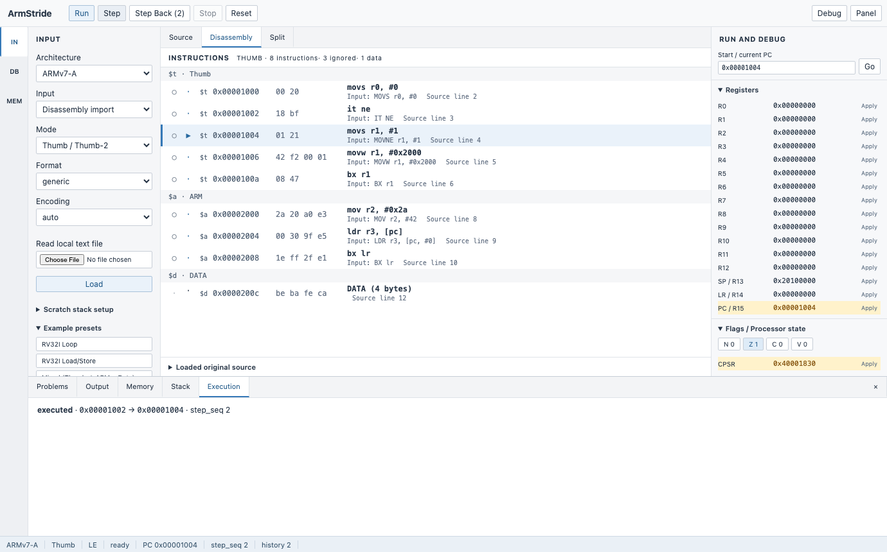
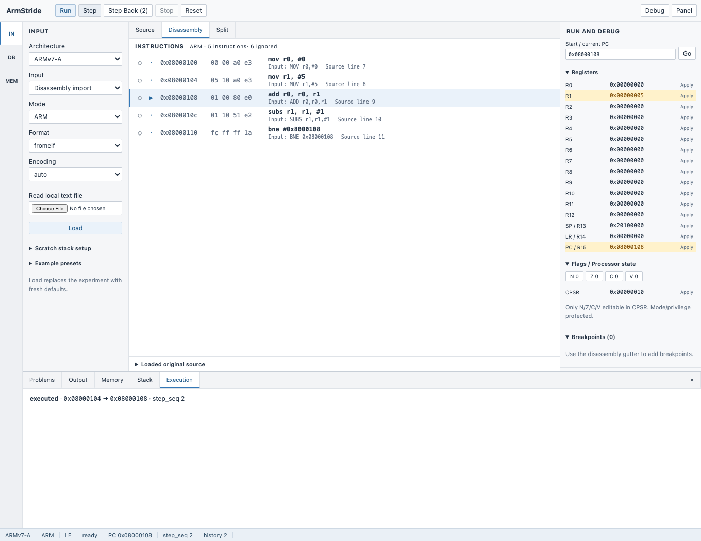
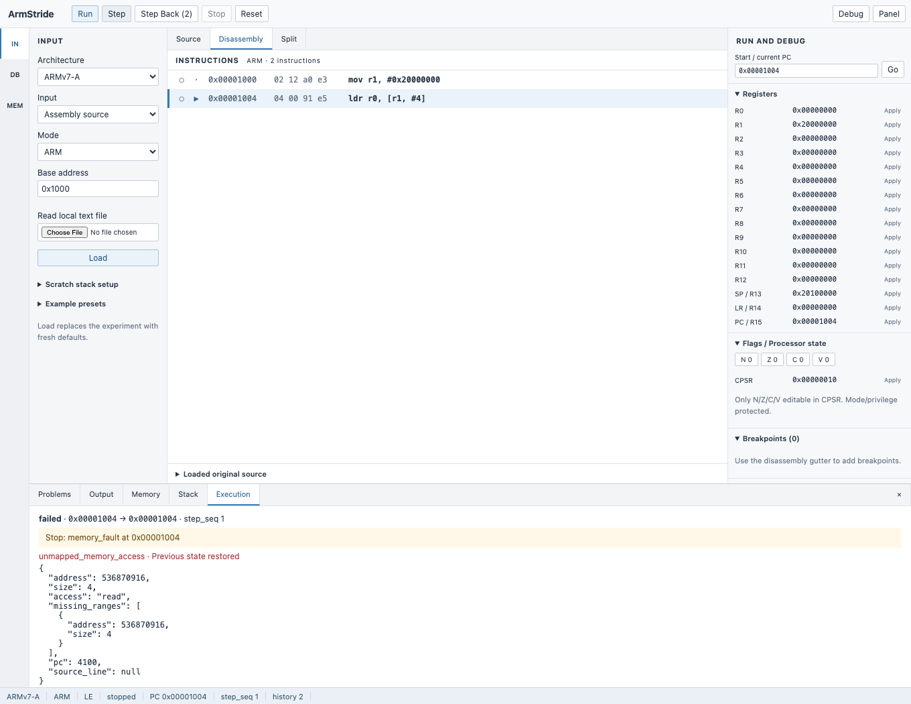
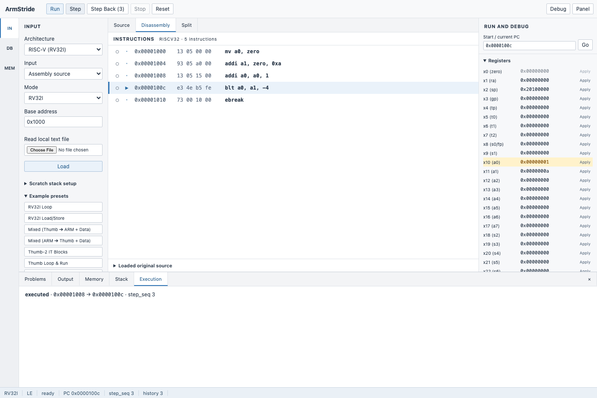

# ArmStride Workbench Walkthrough

ArmStride is a local ARMv7-A, Thumb, and RISC-V RV32I debugging workbench. Its default appearance is **Light**: near-white editors, neutral pane separators, restrained blue accents, and compact machine-state tables.

This walkthrough follows the current UI. Start the application using the [README quickstart](../README.md#-quickstart).

## 1. Find your tools



| Area | Purpose |
| --- | --- |
| Command bar — top | Run, Step, Step Back, Stop, Reset; toggle the Debug sidebar or bottom Panel. |
| Activity Bar — far left | `IN`: input configuration; `DB`: Run limits; `MEM`: shortcuts to memory and stack tools. Click the active tool again to close its sidebar. |
| Primary Sidebar — left | Architecture, input type, mode, base address, file import, Load, scratch-stack settings, and example presets. |
| Editor group — center | Source, Disassembly, and Split tabs. Source holds editable input; Disassembly shows the loaded, decoded program. |
| Run and Debug — right | Manual PC editing and collapsible Registers, ARM Flags / Processor state, Breakpoints, and Watchpoints. |
| Bottom panel | Problems, Output, Memory, Stack, and Execution tabs. |
| Status bar — bottom edge | Loaded architecture, live ARM/Thumb mode where applicable, byte order, session state, PC, step sequence, and history depth. |

The editor, sidebars, and bottom panel scroll independently. Normal desktop debugging does not require scrolling the whole browser page. For more code space, close the Primary Sidebar, toggle **Debug**, or close **Panel**. Tabs and source drafts remain available when you reopen their panes.

The Activity Bar's **DB** button opens Run configuration on the left. The command bar's **Debug** button toggles machine state on the right.

## 2. Load and step through your first program

1. Select **IN** in the Activity Bar.
2. Set **Architecture** to `ARMv7-A`, **Input** to `Assembly source`, **Mode** to `ARM`, and **Base address** to `0x1000`.
3. Open the central **Source** tab and enter:

   ```asm
   mov r0, #5
   add r1, r0, #3
   cmp r1, #8
   ```

4. Click **Load** in the Primary Sidebar. The editor switches to **Disassembly** and the right sidebar displays the loaded registers.
5. Click **Step** or press **F7/F8**. R0 becomes `0x00000005`; the blue current-PC marker advances. Changed registers use an amber highlight.
6. Step again to set R1 to `0x00000008`. Open **Execution** in the bottom panel to inspect the latest instruction result.
7. Click **Step Back** to restore the previous execution state. The status bar shows the remaining history depth.
8. Click **Reset** to restore the experiment's baseline.

Switch back to **Source** to edit the draft, or choose **Split** to see the draft and decoded listing together. Editing source does not change the loaded program until you click **Load** again. Loading replaces the experiment with fresh defaults.

For Thumb assembly, select **Thumb / Thumb-2** before loading. For ready-made examples, expand **Example presets** in the Primary Sidebar; clicking a preset loads it immediately.

### Edit registers or select a PC

Enter a decimal or `0x` hexadecimal value in a register row, then press **Enter** or click its **Apply** button. Manual edits update the Reset baseline. On ARM, the processor-state section exposes CPSR and N/Z/C/V flag controls; only the supported flag bits are editable.

Click a PC marker in the disassembly gutter to fill **Start / current PC**. This does not execute or jump yet. Press **Enter** in that field or click **Go** to apply the address.

## 3. Import disassembly or ELF



### Text disassembly

1. In **IN**, choose **Disassembly import** and the appropriate architecture and mode.
2. Choose **Format** and **Encoding**, or leave them on `auto`.
3. Open **Source** and paste the listing, or use **Read local text file**:

   ```text
   1000: E3A0002A  MOV  r0, #42
   1004: E2801008  ADD  r1, r0, #8
   1008: E58D1000  STR  r1, [sp]
   100C: E59D2000  LDR  r2, [sp]
   ```

4. Click **Load**. Inspect decoded bytes and instructions in **Disassembly**.
5. Use **Problems** for parser/load diagnostics and rejected-import previews. A rejected replacement leaves the previously installed program available.

Mixed ARM/Thumb listings retain `$a`, `$t`, and `$d` sections. Data rows are non-executable and cannot hold breakpoints. The listing retains input/source metadata, unsupported-instruction diagnostics, and automatic scrolling to the current PC.

### ELF files

Choose **ELF32 Binary (.elf)** and use **Select ELF binary**, then click **Load**. Supported ARM/Thumb ELF files open in Disassembly, with symbols and DWARF file/line metadata when present. The Source tab displays an unavailable message because this workflow does not provide editable source text. ELF uploads are limited to 10 MiB.

## 4. Run with breakpoints and watchpoints

1. In **Disassembly**, click the circle beside an instruction to add a breakpoint. The red breakpoint dot remains distinct from the blue current-PC arrow.
2. Open the right sidebar's **Breakpoints** section to review or remove addresses.
3. Click **Run** or press **F5**. Execution stops at a breakpoint, watchpoint, configured limit, or another debugger stop condition. Use **Stop** to interrupt an active run.
4. Open **Execution** to inspect the Run result, committed steps, elapsed time, and stop reason.
5. To change run limits, click **DB** in the Activity Bar and set **Limit steps** and **Time limit (ms)**.

For memory access stops, expand **Watchpoints** on the right. Enter an address, access kind, and byte length, then click **Add**. A matching access reports its triggering PC and address in the watchpoint section. Remove a watchpoint using its row's remove button.

## 5. Inspect memory and repair a fault



In the screenshot, `ldr r0, [r1, #4]` reads unknown memory at `0x20000004`. The instruction fails and its partial effects are rolled back. The **Execution** tab reports the error context and **Previous state restored**.

To inspect or repair memory without leaving the editor:

1. Open the bottom **Memory** tab.
2. Enter **Memory address** and **Inspection bytes**, then click **Inspect memory**. `??` denotes unknown bytes; inspection does not allocate memory.
3. Set **Patch address**, select **Patch type**, and enter hex bytes, a little-endian word, or a zero-fill length.
4. Click **Apply memory patch** or **Zero-fill memory**, then retry the instruction using **Step**.

Manual patches update the Reset baseline. Code is read-only. Inspection supports up to 4096 bytes per request; patches are limited to 64 KiB.

### Follow the stack

Open **Stack** in the bottom panel. The SP row identifies the current stack pointer, and changed bytes are marked with `Δ`. Use **Lower addresses**, **Higher addresses**, or **Follow SP** to navigate. ARM uses SP; RV32I uses `x2 (sp)`.

To configure a new experiment's scratch stack, expand **Scratch stack setup** in **IN**, enable **Use custom scratch stack**, and set the base and size before loading. The default stack is 64 KiB at `0x200f0000`, with SP initially at `0x20100000`.

### Choose the right bottom tab

| Tab | Contents |
| --- | --- |
| Problems | Parser/load diagnostics, API errors, and rejected-import previews. |
| Output | General operation and recovery messages. |
| Memory | Memory inspection and patch tools. |
| Stack | Stack window, SP marker, and navigation. |
| Execution | Latest Step/Run result, branches, IT conditions, memory accesses, and stop reasons. |

Click **×** to close the panel; use the command bar's **Panel** button to reopen it.

## 6. Debug RV32I



1. In **IN**, set **Architecture** to `RISC-V (RV32I)`. Mode becomes `RV32I`.
2. Enter RV32I assembly in **Source**, import a disassembly listing, or expand **Example presets** and choose **RV32I Loop** or **RV32I Load/Store**.
3. After loading, inspect `x0`–`x31` and PC in the right sidebar. ABI aliases such as `ra`, `sp`, and `a0` appear beside register names. Scroll the sidebar to reach additional rows.
4. Step, Run, inspect memory, and use Step Back as in the ARM workflow.

`x0 (zero)` remains immutable. ARM CPSR/NZCV controls are absent, and the status bar identifies RV32I without an ARM mode. `ECALL` and `EBREAK` report `environment_call` and `breakpoint_trap` stop reasons in Execution.

## 7. Shortcuts and session state

| Shortcut | Action |
| --- | --- |
| F5 | Run. |
| F7 / F8 | Step, including while the source editor has focus. |
| F9 | Reset to baseline. |
| Enter in a register field | Apply that register edit. |
| Enter in Start / current PC | Apply the PC edit. |
| Left / Right on a tab | Select the previous / next tab in that group. |
| Home / End on a tab | Select the first / last tab in that group. |

Each page owns its session. Refresh starts a new experiment; idle sessions expire after 30 minutes. Running and pending requests disable conflicting controls.

If an operation's outcome is uncertain or machine state becomes unavailable, follow the recovery notice: Reset or reload as directed. An uncertain program replacement requires another Load. An expired session requires a page refresh. **Output** contains recovery messages; the status bar keeps the current session state visible.

## Current layout limits

The workbench targets desktop and laptop widths. At narrow widths, sidebars use toggleable overlays. Pane dragging, saved layouts, syntax highlighting, and an optional dark theme are not implemented. The default theme remains Light.

## Refreshing screenshots

With the Python environment and frontend dependencies installed, run from `frontend`:

```sh
npm run build
npx playwright test --config playwright-screenshots.config.ts
```

The capture suite writes the four workbench screenshots used by this guide and the README to `docs/assets`.
