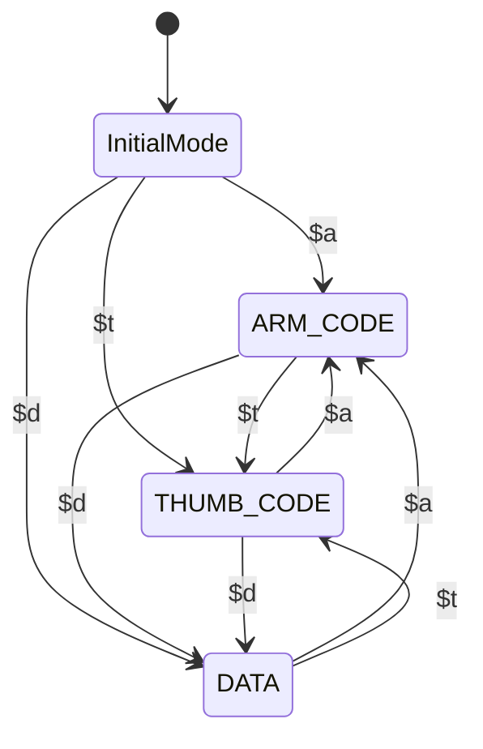
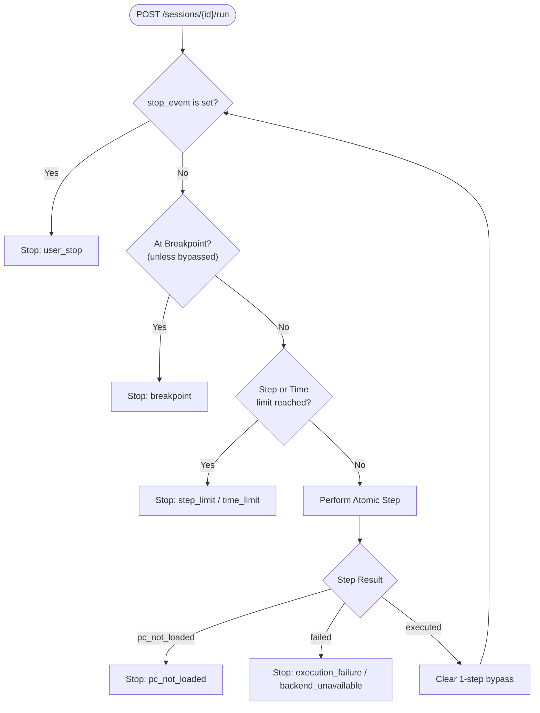
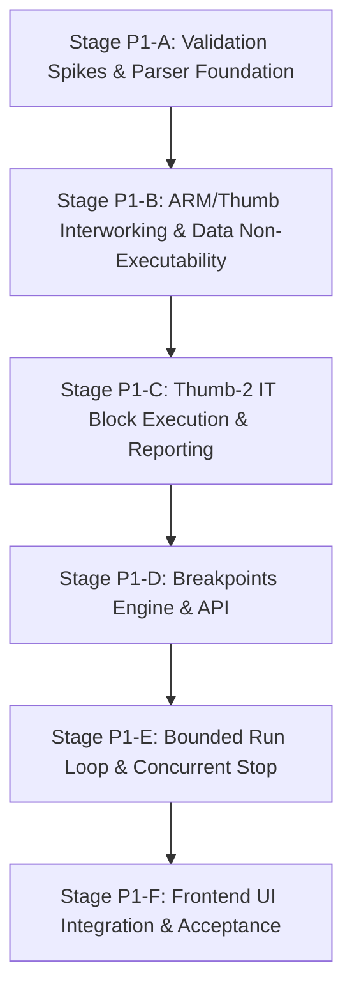

# Product P1 Specification and Implementation Roadmap

**Status:** Implemented & Verified (Stages P1-A through P1-F complete; all P1-AC-01 through P1-AC-16 criteria passing)  
**Document Version:** 1.0  
**Baseline:** Product P0 Accepted Baseline (388 Python unit/integration tests passing; Playwright acceptance passing)  
**Target Release:** ArmStride Product P1  

---

## 1. Executive Summary and Product Baseline

### 1.1 Baseline Acceptance
Product P0 is complete, verified, and accepted as the stable baseline. The historical implementation Phases 0–8 are immutable development evidence and are preserved as historical context.

The accepted P0 baseline guarantees:
- ARMv7-A little-endian architecture profile running on pinned Unicorn 2.1.4.
- Single-mode ARM and Thumb/Thumb-2 execution from assembly source or disassembly import.
- Unified single `ProgramImage` simulation pipeline.
- Strictly atomic `step()` execution with snapshot rollback on faults.
- Strict exact-byte memory semantics (unmapped reads halt; unmapped writes fail without mutation).
- Baseline vs. runtime state isolation with non-destructive `reset()`.
- Synchronous local HTTP REST API (`/sessions`, `/step`, `/reset`, `/registers`, `/memory`).
- Interactive browser UI (Svelte 5, TypeScript, Vite) serving code, registers, memory, stack, and diagnostics.
- Independent packaging and local execution via `uv run armstride`.

All 388 existing Python tests and Playwright test workflows remain mandatory regression criteria throughout Product P1 development.

### 1.2 Product P1 Objectives
Product P1 expands ArmStride's execution capabilities to handle realistic mixed-mode binary listings, conditional execution blocks, and controlled multi-step execution.

Product P1 is strictly bounded to four cohesive feature groups:
1. **Mixed ARM / Thumb / Data ProgramImages** (via `$a`, `$t`, `$d` mapping symbols).
2. **Thumb-2 IT Block Execution** (verified via an empirical spike).
3. **Bounded Run / Stop** (composing atomic Steps).
4. **Breakpoints** (pre-execution semantics with resume bypass).

### 1.3 Explicit Non-Goals and Out-of-Scope Capabilities
To maintain architectural purity and delivery velocity, the following are strictly excluded from Product P1:
- Non-ARM architectures (RISC-V, AArch64, x86, MIPS).
- Cortex-M exception and interrupt models (NVIC, PendSV, SysTick).
- Full-system emulation, MMU page tables, or OS privilege transitions.
- Symbolic execution, constraint solving, or angr dependencies.
- Direct ELF, Mach-O, or PE binary loading (import remains listing-driven).
- Reverse execution, time-travel debugging, or historical state undo trees.
- Watchpoints (data breakpoints) or complex conditional breakpoint expressions.
- GDB remote serial protocol (GDB server).
- WebSocket or Server-Sent Events (SSE) streaming transport.
- Multi-mode assembly source snippets (assembly source input remains single-mode per snippet).

---

## 2. Product P1 Feature Group Specifications

### 2.1 Feature Group 1: Mixed ARM / Thumb / Data ProgramImages

#### 2.1.1 Mapping Symbols as Parser Transitions
In disassembly/import listings, ARM mapping symbols define section transitions:
- `$a`: Transitions parser state to `ARM_CODE`. Subsequent instructions are parsed and validated as 32-bit ARM instructions.
- `$t`: Transitions parser state to `THUMB_CODE`. Subsequent instructions are parsed and validated as 16-bit Thumb or 32-bit Thumb-2 instructions.
- `$d`: Transitions parser state to `DATA`. Subsequent lines are parsed as concrete data bytes (e.g., literal pools, constant tables).

Mapping symbols themselves do not generate instructions or advance memory addresses; they alter the active parser state machine.



#### 2.1.2 Domain Representation: Decoupling Code and Data
`DATA` is strictly a memory classification, **never a CPU execution mode**. ArmStride shall not define `Instruction.mode = DATA`.

The domain model evolves from a homogeneous instruction list to a composite image:
```text
ProgramImage
├── instructions: Sequence[Instruction]
│   ├── ARM instructions (mode=ARM)
│   └── Thumb instructions (mode=THUMB)
└── data_regions: Sequence[DataRegion]
    └── address, bytes, source_line
```

A `DataRegion` record encapsulates:
- `address`: Canonical integer starting address.
- `data`: Exact immutable `bytes`.
- `size`: Length in bytes (`len(data)`).
- `source_line`: Original source text line index.

#### 2.1.3 Data Region Semantics
Data regions are concrete known memory:
- **Known Memory Population:** When loading a ProgramImage into `SimulationSession`, bytes from all `DataRegion` entries are loaded into `MemoryState` as known, readable memory.
- **Literal Pool Reads:** Memory reads via `LDR rX, [pc, #imm]` or register indirect addressing into data regions succeed normally.
- **Strict Non-Executability:** Data addresses are strictly non-executable. Any attempt to execute an instruction at an address covered by a `DataRegion` immediately halts execution (reporting `pc_not_loaded` or raising `unsupported_instruction`/`memory_permission_denied`).
- **Validation and Overlap Checks:** During parser normalization, address intervals for instructions and data regions are validated against each other. Overlaps (instruction-instruction, instruction-data, data-data) are rejected with HTTP 422.
- **No Fake Instructions or Zero-Fill:** Data bytes are never decoded as instructions, nor are absent bytes zero-filled.

#### 2.1.4 Source Assembly Input Boundary
In Product P1, **assembly-source input remains single-mode per snippet**, identical to P0. Assembly source is compiled via Keystone in either ARM or Thumb mode. Mixed-mode images are imported exclusively through disassembly listings containing mapping symbols.

---

### 2.2 Feature Group 2: Runtime ARM/Thumb Interworking

#### 2.2.1 Execution Location Model: `(address, mode)`
In P1, execution state cannot be represented solely by numeric PC. An executable location is formally:
```text
ExecutionLocation = (address: int, mode: CpuMode)
```
where `mode` is `CpuMode.ARM` or `CpuMode.THUMB`.

#### 2.2.2 Authoritative Native Interworking via CPSR T-bit
Interworking is not handled by synthetic heuristic detection of specific branch mnemonics (`BX`, `BLX`). Instead, native execution on Unicorn is authoritative for all architectural state transitions:
1. Native instruction executes one Step.
2. Read resulting architectural `PC` and `CPSR` from Unicorn.
3. Determine post-execution mode directly from CPSR bit 5 (the `T` bit, `0x00000020`):
   - `T == 0`: Mode is `CpuMode.ARM`.
   - `T == 1`: Mode is `CpuMode.THUMB`.
4. Canonicalize visible PC by masking bit 0: `canonical_pc = pc & ~1`.
5. Resolve `(canonical_pc, mode)` against the session's `ProgramImage`.
6. If an instruction exists at that canonical address with the matching mode, execution is ready for the next step.
7. If no instruction exists at that address, or if an instruction exists under a different mode, execution halts cleanly with `stop_reason: pc_not_loaded`.

#### 2.2.3 Architectural Scope of Interworking Instructions
Any supported instruction capable of modifying PC and the CPSR T-bit participates in interworking:
- `BX Rm`, `BLX Rm`, `BLX <label>`
- `POP {..., pc}`
- `LDMIA / LDM Rn, {..., pc}`
- Arithmetic writes to PC (`MOV pc, lr`, etc., where architecturally valid)

#### 2.2.4 Transactional Integrity and Rollback
A mode transition is a valid architectural state update, not an error. However, transactional rollback guarantees apply strictly:
- If a mode-switching instruction triggers a memory fault (e.g. `LDM` popping missing stack words), CPU state, memory, and CPSR are completely rolled back to pre-instruction state.
- Successful interworking commits exactly one atomic Step, advancing `step_seq` by 1.

---

### 2.3 Feature Group 3: Thumb-2 IT Blocks Execution

#### 2.3.1 Mandatory Execution Semantics Spike
Before writing any production code for IT blocks, an isolated semantics validation spike must run against pinned Unicorn 2.1.4 in `spikes/p1_it/`.

The spike must verify:
- Single-instruction blocks: `IT <cond>` + 1 instruction.
- Multi-instruction blocks: `ITT <cond>`, `ITE <cond>`, `ITTE <cond>`, `ITEE <cond>` (up to 4 instructions).
- Evaluation under both true and false condition flag settings (NZCV).
- Proper step-by-step preservation of `ITSTATE` in CPSR (`CPSR[15:10, 26:25]`) when stepping with `count=1`.
- Verification that conditionally skipped instructions advance PC by their exact instruction width (16-bit or 32-bit) without executing side effects or memory accesses.
- Verification that manual entry into mid-IT-block without valid ITSTATE is detectable and rejectable.

**Stop/Go Gate:** If Unicorn 2.1.4 fails to maintain `ITSTATE` across single-step boundaries, production IT development is halted until an adapter-level workaround or upstream solution is documented.

#### 2.3.2 Execution Reporting: `executed` vs. `condition_passed`
An instruction whose condition evaluates to false inside an IT block is conditionally skipped. A skipped instruction must be cleanly distinguished from an instruction that executed normally but produced identical values (e.g., `ORR r0, r0, #0`).

The `StepResult` contract is extended:
```json
{
  "status": "executed",
  "executed": true,
  "condition_passed": true,
  "it_context": {
    "block_index": 1,
    "block_total": 2,
    "condition": "EQ",
    "passed": true
  }
}
```

- **Executed with state change:** `status: "executed"`, `executed: true`, register/memory changes populated.
- **Executed without state change (same-value write):** `status: "executed"`, `executed: true`, empty register changes, `condition_passed: true`.
- **Conditionally skipped:** `status: "executed"`, `executed: false`, `condition_passed: false`, empty register/memory changes, `it_context.passed: false`.
- **Failed Step (memory fault, illegal instruction):** `status: "failed"`, `executed: false`, `error: {...}`.

#### 2.3.3 Rejection of Manual Entry into IT Blocks
Setting PC manually (via Go or manual edit) to an instruction inside an IT block without preceding IT execution leaves `ITSTATE == 0`. ArmStride shall detect attempts to execute a mid-IT-block instruction with invalid IT context and reject the step with `invalid_pc` or `unsupported_instruction`, preserving machine state.

#### 2.3.4 Breakpoints Inside IT Blocks
Setting a breakpoint on an instruction inside an IT block is fully supported. When the breakpoint is hit:
- The instruction is not yet executed (pre-execution semantics).
- The full CPU state, including CPSR with active `ITSTATE`, is preserved.
- When Run or Step resumes, the instruction executes under its intended IT condition.

---

### 2.4 Feature Group 4: Bounded Run and Breakpoints

#### 2.4.1 Bounded Run Engine
Product P1 Run is implemented by composing the proven, atomic `SimulationSession.step()` method in a bounded loop. There is **zero parallel execution code** and no unmonitored native multi-instruction execution.



#### 2.4.2 Run Bounds
Every Run execution is strictly bounded by two parameters:
- `max_steps`: Maximum number of atomic Steps committed during the run (default: 10,000; configurable per request).
- `timeout_seconds`: Wall-clock execution ceiling (default: 2.0 seconds; configurable per request).

Reaching either limit cleanly halts execution at a valid committed Step boundary with `stop_reason: "step_limit"` or `stop_reason: "time_limit"`.

#### 2.4.3 Stop Semantics and Concurrency
To ensure that a user can stop a running session without deadlock:
- `SessionEntry` maintains a thread-safe `stop_event: threading.Event`.
- While `run()` holds the session mutation lock, `POST /sessions/{id}/stop` does **not** acquire the mutation lock. It immediately sets `stop_event.set()`.
- Between individual Steps, `run()` checks `stop_event.is_set()`.
- Upon observing cancellation, `run()` stops before attempting the next Step, returning `stop_reason: "user_stop"`.
- Machine state is always at a clean, fully committed architectural Step boundary.

#### 2.4.4 Breakpoints
Breakpoints use pre-execution semantics:
- **Identity:** Breakpoints are registered by `(address: int, mode: CpuMode)`.
- **Pre-execution Stop:** If current `(canonical_pc, mode)` matches an active breakpoint, Run halts *before* executing that instruction, returning `stop_reason: "breakpoint"` and `breakpoint_hit: address`.
- **One-Step Resume Bypass:** To allow resuming from a breakpoint without getting permanently trapped, the next `run()` or `step()` invocation performs a one-time bypass of the breakpoint at the current PC for exactly one Step. Subsequent steps re-enable checking.

#### 2.4.5 HTTP Transport Model
Run and Stop use synchronous HTTP REST endpoints:
- `POST /sessions/{id}/run`: Long-polling request that remains open while the bounded loop executes, returning `RunResult` upon completion.
- `POST /sessions/{id}/stop`: Lightweight, immediate endpoint returning `{"signaled": true}`.
- `GET /sessions/{id}/breakpoints`: Lists all registered breakpoints.
- `POST /sessions/{id}/breakpoints`: Adds a breakpoint at `{address: int, mode?: string}`.
- `DELETE /sessions/{id}/breakpoints/{address}`: Removes a breakpoint.

---

## 3. Dependency-Ordered Implementation Roadmap

The implementation of Product P1 proceeds across six sequential stages. Each stage is gated by strict completion conditions and full P0 regression verification.



### Stage P1-A: Validation Spikes & Parser Foundation
**Scope:**
1. Author and execute Thumb-2 IT block semantics spike under `spikes/p1_it/`.
2. Extend `ProgramImage` domain to include `data_regions: Sequence[DataRegion]`.
3. Add `$a`, `$t`, `$d` mapping symbol state machine transitions to disassembly parsers (`fromelf`, `objdump`, `generic`).
4. Implement address overlap validation (instruction-instruction, instruction-data, data-data).

**Exit Criteria:**
- Spike report completed with recorded observations.
- All mapping symbols parse into correct code and data segments.
- Overlapping instructions or data are rejected with HTTP 422.
- 388 baseline tests pass without regression.

---

### Stage P1-B: ARM/Thumb Runtime Interworking & Data Non-Executability
**Scope:**
1. Implement post-step CPSR T-bit inspection and canonical PC calculation (`pc & ~1`) in `UnicornBackend` and `SimulationSession`.
2. Enforce `(address, mode)` execution target resolution against `ProgramImage`.
3. Populate `MemoryState` with known bytes from `DataRegion` upon program load.
4. Enforce strict non-executability of data regions (execution attempt stops with `pc_not_loaded` or raises error).
5. Add golden execution cases for interworking branches (`BX`, `BLX`, `POP {pc}`, `LDM {pc}`).
6. Supersede P0 synthetic `GE-26` test case with valid interworking verification.

**Exit Criteria:**
- Interworking branches cleanly switch mode in a single atomic Step.
- Data bytes are readable via `LDR` but unexecutable.
- Golden execution suite passes.
- 388 baseline tests pass (with GE-26 updated).

---

### Stage P1-C: Thumb-2 IT Block Execution & Skip Reporting
**Scope:**
1. Implement preflight IT block entry validation (reject manual jumps into mid-IT-block).
2. Extend `StepResult` domain model with `executed: bool` and `it_context: Optional[ITContext]`.
3. Implement conditional skip reporting: distinguish executed same-value writes from conditional skips.
4. Add golden execution cases covering `IT`, `ITT`, `ITE` with true/false conditions.

**Exit Criteria:**
- Stepping through IT blocks correctly evaluates conditions and updates or preserves registers.
- StepResult explicitly reports `executed: false` and `condition_passed: false` for skipped instructions.
- Full regression suite passes.

---

### Stage P1-D: Breakpoints Engine & API
**Scope:**
1. Add `Breakpoint` domain entity keyed by `(address, mode)`.
2. Implement session breakpoint registry (`add_breakpoint`, `remove_breakpoint`, `list_breakpoints`, `clear_breakpoints`).
3. Implement pre-execution breakpoint check with single-step resume bypass.
4. Preserve architectural context (including ITSTATE) upon breakpoint hit.
5. Implement REST API endpoints:
   - `GET /sessions/{id}/breakpoints`
   - `POST /sessions/{id}/breakpoints`
   - `DELETE /sessions/{id}/breakpoints/{address}`

**Exit Criteria:**
- Breakpoints stop execution before the target instruction executes.
- Resuming past a breakpoint steps exactly one instruction without re-triggering.
- API tests verify CRUD operations and error handling.
- Full regression suite passes.

---

### Stage P1-E: Bounded Run Loop & Concurrent Stop
**Scope:**
1. Add `stop_event = threading.Event()` to `SessionEntry`.
2. Implement `run()` loop in `SimulationSession` composing `step()` calls.
3. Implement step count limit (`max_steps`) and wall-clock execution limit (`timeout_seconds`).
4. Implement REST API endpoint `POST /sessions/{id}/run` returning `RunResult`.
5. Implement non-blocking REST API endpoint `POST /sessions/{id}/stop` setting `stop_event`.
6. Add unit and integration tests for bounded run, stop cancellation, limit stops, and breakpoint hits.

**Exit Criteria:**
- Run cleanly halts on breakpoints, step limits, time limits, user stop, or execution faults.
- Stop cancellation interrupts running loops cleanly at a committed step boundary.
- All session state remains strictly transactional and recoverable.
- Full regression suite passes.

---

### Stage P1-F: Frontend UI Integration & Acceptance Verification
**Scope:**
1. Update `CodeView` to render `$a`, `$t`, `$d` section badges and format data regions.
2. Add clickable breakpoint toggle gutter to `CodeView`.
3. Add `Run` and `Stop` buttons with step counter and limit indicators to `Toolbar`.
4. Update `StatusPanel` to display Run summaries, termination reasons, and IT block context.
5. Implement frontend API client methods for run, stop, and breakpoints.
6. Author Playwright acceptance tests covering:
   - Mixed-mode listing load and stepping across ARM/Thumb boundaries.
   - Thumb-2 IT block execution and visual skip indication.
   - Setting breakpoints and running to breakpoint.
   - Resuming from breakpoint.
   - User Stop during long execution.
7. Run complete P0 and P1 test suites.

**Exit Criteria:**
- All Product P1 acceptance criteria (`P1-AC-01` through `P1-AC-16`) pass.
- All Product P0 acceptance criteria (`AC-01` through `AC-21`) pass.
- Zero regressions across the entire product.

---

## 4. Technical Risk Register and Spike Protocols

| Risk ID | Description | Severity | Mitigation & Verification Protocol |
| --- | --- | --- | --- |
| **R-01** | Unicorn 2.1.4 fails to preserve `ITSTATE` across single-step (`count=1`) invocations. | High | **Mandatory Spike in Stage P1-A:** Execute `spikes/p1_it/probe.py` testing consecutive `emu_start(..., count=1)` calls. If ITSTATE is cleared by Unicorn, evaluate explicit ITSTATE preservation via CPSR hooks before proceeding. |
| **R-02** | Discrepancy between PC bit 0 masking and CPSR T-bit during interworking branches. | Medium | Assert that canonical visible PC is always `pc & ~1`, while mode is strictly governed by CPSR bit 5. Test all interworking branch instructions in Stage P1-B golden cases. |
| **R-03** | Race conditions between concurrent `/run` and `/stop` requests. | Medium | `stop()` sets a dedicated `stop_event: threading.Event()` without acquiring the session's operation lock. `run()` checks `stop_event.is_set()` between steps while holding the operation lock. |
| **R-04** | Infinite loop on resume when stopping at a breakpoint. | Medium | Implement explicit 1-step resume bypass: if Run or Step begins at a breakpoint address, suppress breakpoint detection for that initial step only. |
| **R-05** | Parsing ambiguous listings containing mapping symbols without addresses. | Low | Disassembly parsers validate that mapping symbols establish state without consuming address space. Malformed directives produce clear diagnostics with line numbers. |

---

## 5. API Contracts for Product P1

### 5.1 POST `/sessions/{session_id}/run`
Executes instructions in a bounded loop until a termination condition is met.

**Request Body (optional):**
```json
{
  "max_steps": 10000,
  "timeout_seconds": 2.0
}
```

**Response Body (200 OK):**
```json
{
  "stop_reason": "breakpoint",
  "steps_executed": 42,
  "elapsed_ms": 15.4,
  "breakpoint_hit": 134218020,
  "last_step_result": {
    "status": "executed",
    "executed": true,
    "step_seq": 42,
    "instruction": {
      "address": 134218016,
      "size": 4,
      "source_line": 12
    },
    "pc_before": 134218016,
    "pc_after": 134218020,
    "condition_passed": true,
    "it_context": null,
    "register_changes": {
      "r0": { "before": "0x00000000", "after": "0x00000005" }
    },
    "cpsr_change": null,
    "flag_changes": {},
    "memory_reads": [],
    "memory_writes": [],
    "branch": null,
    "stop_reason": null,
    "error": null
  },
  "state": {
    "pc": 134218020,
    "cpsr": 16,
    "registers": { ... }
  }
}
```

### 5.2 POST `/sessions/{session_id}/stop`
Signals cancellation to an active Run execution.

**Response Body (200 OK):**
```json
{
  "signaled": true
}
```

### 5.3 Breakpoint Endpoints

#### GET `/sessions/{session_id}/breakpoints`
**Response Body (200 OK):**
```json
{
  "breakpoints": [
    { "address": 134218020, "mode": "thumb" }
  ]
}
```

#### POST `/sessions/{session_id}/breakpoints`
**Request Body:**
```json
{
  "address": 134218020,
  "mode": "thumb"
}
```
**Response Body (201 Created):**
```json
{
  "address": 134218020,
  "mode": "thumb"
}
```

#### DELETE `/sessions/{session_id}/breakpoints/{address}`
**Response Body (204 No Content)**

---

## 6. Golden Execution Test Plan for P1

The golden execution suite is expanded to cover P1 behaviors (`GE-21` through `GE-35`):

| Case ID | Feature Group | Description | Expected Outcome |
| --- | --- | --- | --- |
| `GE-21` | Interworking | `BX Rm` switching ARM to Thumb | Step 1 switches mode; PC canonicalized (`pc & ~1`); CPSR T-bit set; target Thumb instruction ready. |
| `GE-22` | Interworking | `BX Rm` switching Thumb to ARM | Step 1 switches mode; CPSR T-bit cleared; target ARM instruction ready. |
| `GE-23` | Interworking | `BLX Rm` call with mode switch | Mode switches; LR updated with return address; CPSR T-bit set appropriately. |
| `GE-24` | Interworking | `POP {r0, pc}` interworking return | Registers popped; PC loaded; mode determined by popped PC bit 0. |
| `GE-25` | Interworking | Interworking branch to external address | Step commits state change; stops with `stop_reason: pc_not_loaded`. |
| `GE-26` | Interworking | Replaced P0 GE-26 (valid mode switch) | Verifies that mode transition succeeds atomically (supersedes P0 error). |
| `GE-27` | Data Regions | Read from literal pool in DataRegion | `LDR r0, [pc, #offset]` reads known data bytes successfully. |
| `GE-28` | Data Regions | Execution attempt into DataRegion | Direct branch or sequential execution into DataRegion halts with `pc_not_loaded`. |
| `GE-29` | Thumb-2 IT | Single `IT EQ` condition true | Condition passes; instruction executes with deltas; ITSTATE clears. |
| `GE-30` | Thumb-2 IT | Single `IT EQ` condition false | Condition fails; instruction conditionally skips (`executed: false`); PC advances; ITSTATE clears. |
| `GE-31` | Thumb-2 IT | Multi-instruction `ITT NE` mixed | Sequential steps evaluate condition; all controlled instructions execute when NE. |
| `GE-32` | Thumb-2 IT | Alternating `ITE EQ` block | Step 1 executes when EQ; Step 2 skips; ITSTATE progression verified across steps. |
| `GE-33` | Breakpoints | Run stops at breakpoint | Run executes until matching breakpoint address; halts before instruction; context preserved. |
| `GE-34` | Breakpoints | Resume past breakpoint | Subsequent Step/Run bypasses breakpoint for exactly 1 step; continues execution. |
| `GE-35` | Bounded Run | Step limit and User Stop | Run cleanly halts when `max_steps` reached or when `stop_event` is set. |

---

## 7. Acceptance Criteria (P1-AC-01 through P1-AC-16)

The complete product acceptance criteria for Product P1 are defined in SRS Section 15.2:
- `P1-AC-01`: Mixed Disassembly Listing Import
- `P1-AC-02`: Address Overlap Rejection
- `P1-AC-03`: Data Region Memory Population
- `P1-AC-04`: Direct Execution Prevention for Data
- `P1-AC-05`: ARM to Thumb Runtime Interworking
- `P1-AC-06`: Thumb to ARM Runtime Interworking
- `P1-AC-07`: Interworking Transactional Rollback
- `P1-AC-08`: Thumb-2 IT Block Semantics Spike
- `P1-AC-09`: IT Block Execution and Skip Reporting
- `P1-AC-10`: Mid-IT-Block Manual Entry Rejection
- `P1-AC-11`: Breakpoint Inside IT Block
- `P1-AC-12`: Breakpoint Registration and Pre-Execution Stop
- `P1-AC-13`: Breakpoint Single-Step Resume Bypass
- `P1-AC-14`: Bounded Run Execution and Limits
- `P1-AC-15`: Concurrent User Stop Without Deadlock
- `P1-AC-16`: Full P0 Baseline Regression Retention

---

## 8. P0 Baseline Compatibility and Contract Evolution

1. **Reconciliation of P0 GE-26:**
   - In P0, runtime mode transitions were considered unsupported and resulted in `unsupported_mode_transition` error rollback.
   - In P1, valid mode transitions via supported instructions (`BX`, `BLX`, `POP {pc}`, etc.) are supported and commit cleanly.
   - The test case `GE-26` is updated in Stage P1-B to assert successful interworking and target resolution.
2. **StepResult Contract Backwards Compatibility:**
   - P0 clients expect `status: "executed"` or `"failed"`.
   - In P1, `status` remains `"executed"` even for conditionally skipped instructions, preserving client expectations. The new fields `executed: bool` and `it_context` provide additive disambiguation.
3. **Immutability of Historical Evidence:**
   - Historical implementation documents (`docs/PHASE8.md`, `spikes/phase0/`) remain untouched as historical records.
